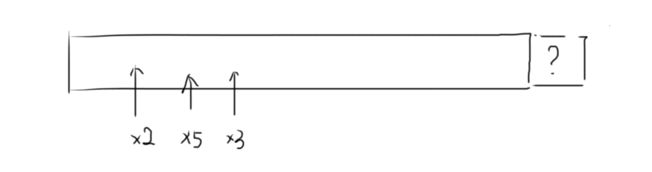

# 丑数

把只包含质因子2、3和5的数称作丑数（Ugly Number）。例如6、8都是丑数，但14不是，因为它包含质因子7。 习惯上我们把1当做是第一个丑数。求按从小到大的顺序的第N个丑数。

## Idea



## Solution

- 方法一：Straight Forward (Time Limit Exceeded)

```java
public class Solution {
    public int GetUglyNumber_Solution(int n) {
        int i=0, num=0;
        while (i < n) {
            num++;
            if (isUgly(num)) i++;
        }
        return num;
    }
     
    private boolean isUgly(int num) {
        if (num == 0) return false;
        while (num % 2 == 0) num /= 2;
        while (num % 3 == 0) num /= 3;
        while (num % 5 == 0) num /= 5;
        return num == 1;
    }
}
```

- 方法二：空间换时间，保存已找到的丑数

 ```java
public class Solution {
    public int GetUglyNumber_Solution(int n) {
        if (n == 0) return 0;

        int[] nums = new int[n];
        nums[0] = 1;
        //p2，p3，p5分别为三个队列的指针
        int p2=0, p3=0, p5=0;
        for (int i=1; i<n; i++) {
            // 取三个候选数中最小的，并increment与最小值相对应的所有指针
            nums[i] = Math.min(nums[p2]*2, Math.min(nums[p3]*3, nums[p5]*5));
            // 这三个if有可能进入一个或者多个，比如p2=3, p3=2时，p2*2等于p3*3等于6
            if (nums[p2]*2 == nums[i]) p2++;
            if (nums[p3]*3 == nums[i]) p3++;
            if (nums[p5]*5 == nums[i]) p5++;
        }
        return nums[n-1];
    }
}
 ```

每次新选出的数是三个候选数的最小值，设这三个候选数为n2, n3, n5，新选出的数记为m，则m = min{ n2, n3, n5 }，也就是说n2, n3, n5 ≥ m，而如果与m相等的话其指针会被后移，所以在执行下一轮时，三个候选数都必然 > m，因此下一轮选出的最小值一定比之前一个大，即不用担心会出现“回退”的现象。

