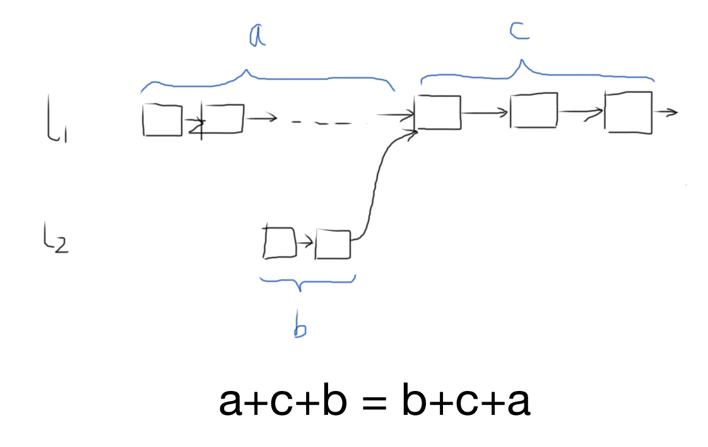

# 两个链表的第一个公共结点

输入两个链表，找出它们的第一个公共结点。

## Idea



## Solution

```java
/*
public class ListNode {
    int val;
    ListNode next = null;

    ListNode(int val) {
        this.val = val;
    }
}*/
public class Solution {
    public ListNode FindFirstCommonNode(ListNode pHead1, ListNode pHead2) {
        ListNode p1 = pHead1, p2 = pHead2;
        while (p1 != p2) {
            p1 = (p1==null)? pHead2 : p1.next;
            p2 = (p2==null)? pHead1 : p2.next;
        }
        return p1;
    }
}
```

> ⚠️注意不能写成下面这样：
>
> ```java
> while (p1 != p2) {
>     p1 = (p1.next==null)? pHead2 : p1.next;
>     p2 = (p2.next==null)? pHead1 : p2.next;
> }
> ```
>
> 如果两个连表确实有公共结点，这样写也是正确的；但如果没有公共结点，程序就会陷入死循环，如下图：
>
> 
>
> 而第一种写法则巧妙地包含了这种情况，当p1沿着 $l_1$ → $l_2$ 走到 $l_2$ 的末端（null），而p2也恰好沿着 $l_2$ → $l_1$ 走到 $l_1​$ 的末端（null），这时p1==p2，则退出循环。
>
> 而第二种写法中，p1走到 $y$ 时，p2走到 $x$ ，但依然 p1 != p2，然后p1会重新回到pHead2，再走到 $y$ ，然后再回到pHead2 …… 同样的，p2走到 $x$ 后会重新回到pHead1，再走到 $x$ ，然后再回到pHead1 ……