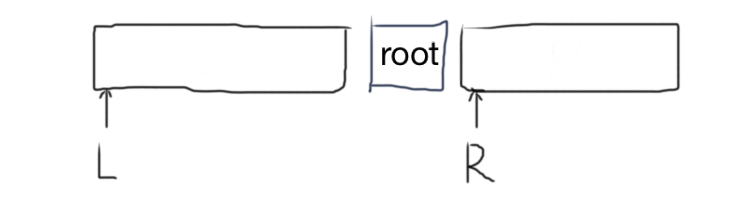
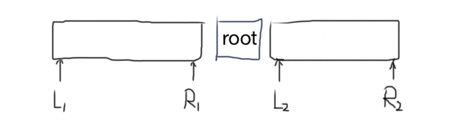

# 二叉搜索树与双向链表

输入一棵二叉搜索树，将该二叉搜索树转换成一个排序的双向链表。要求不能创建任何新的结点，只能调整树中结点指针的指向。

## Solution

- 方法一：$O(n^2)$ 



```java
/**
public class TreeNode {
    int val = 0;
    TreeNode left = null;
    TreeNode right = null;

    public TreeNode(int val) {
        this.val = val;

    }
}
*/
public class Solution {
    public TreeNode Convert(TreeNode root) {
        if (root == null) return null;
        
        TreeNode L = Convert(root.left);
        TreeNode R = Convert(root.right);

        TreeNode head = root;
        if (L != null) {
            head = L;
            // find rightmost node of L
            while (L.right != null) L = L.right;
            root.left = L;
            L.right = root;
        }
        if (R != null) {
            root.right = R;
            R.left = root;
        }
        return head;
    }
}
```

- 方法二： O(n)



```java
public class Solution {
    public TreeNode Convert(TreeNode root) {
        if (root == null) return null;
        return helper(root).L;
    }
    
    private LR helper(TreeNode root) {
        TreeNode L = root, R = root;    // default values
        
        if (root.left != null) {
            LR leftList = helper(root.left);
            L = leftList.L;
            root.left = leftList.R;
            leftList.R.right = root;
        }
        
        if (root.right != null) {
            LR rightList = helper(root.right);
            R = rightList.R;
            root.right = rightList.L;
            rightList.L.left = root;
        }
        
        return new LR(L, R);
    }
    
    public static class LR {
        public TreeNode L;
        public TreeNode R;
        
        public LR(TreeNode L, TreeNode R) {
            this.L = L;
            this.R = R;
        }
    }
}
```

