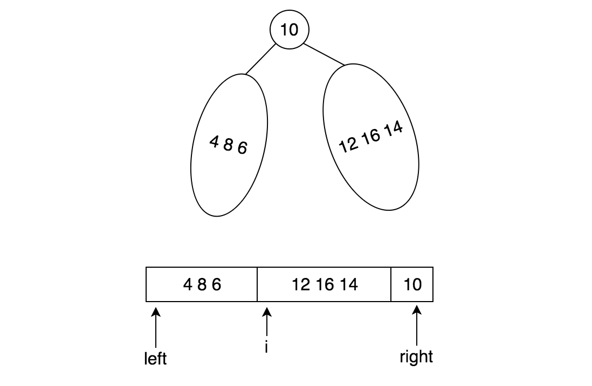

# 二叉搜索树的后序遍历序列

输入一个整数数组，判断该数组是不是某二叉搜索树的后序遍历的结果。如果是则输出Yes,否则输出No。假设输入的数组的任意两个数字都互不相同。

## Idea

左子树的元素都比root小，右子树的元素都比root大（distinct），可以从左向右遍历找到第一个大于root的元素位置，记为`i`，那么`i`右边的元素（最后一个元素是root，除外）应该都比root大，最后再递归调用来判断左侧数组与右侧数组是否都是有效的后续遍历序列。

## Example



## Solution

```java
public class Solution {
    
    public boolean VerifySquenceOfBST(int[] A) {
        int n = A.length;
        if (n == 0) return false;	// 按理说应该true才对❓
        return isValid(A, 0, n-1);
    }
    
    private boolean isValid(int[] A, int left, int right) {
        if (left >= right) return true;
        
        int root = A[right];
        int i = left;
        while (A[i] < root) i++;
        
        for (int j=i; j<right; j++) {
            if (A[j] < root) return false;
        }
        
        return isValid(A, left, i-1) && isValid(A, i, right-1);
    }
}
```

按理说n==0时应该是true，但不知道为什么这题的测试用例写为false，所以上面多加了一个special case.