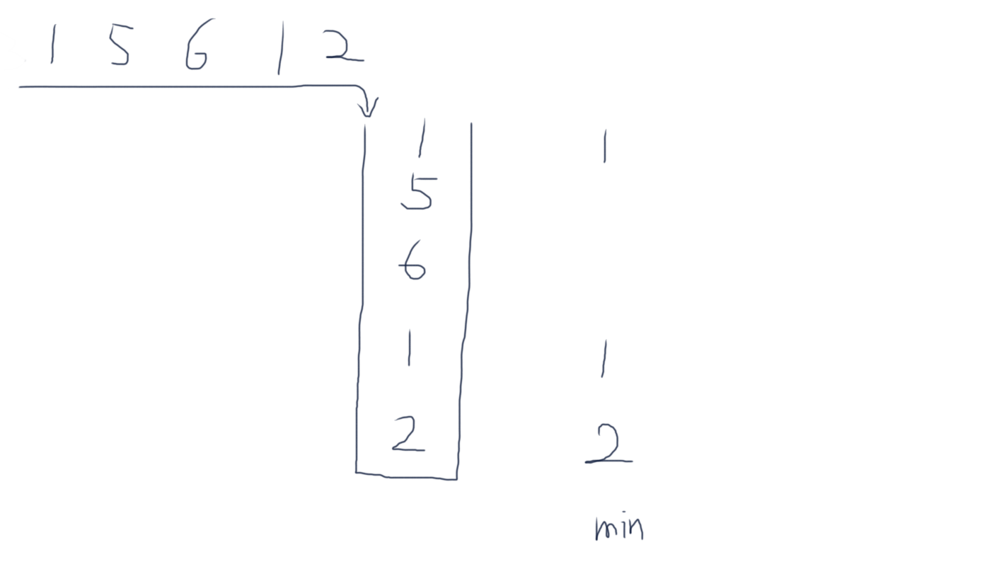

# 包含min函数的栈

定义栈的数据结构，请在该类型中实现一个能够得到栈中所含最小元素的min函数，时间复杂度应为O(1).

## Idea

[举例让抽象具体化]



## Solution

```java
import java.util.Stack;

public class Solution {
    Stack<Integer> stack = new Stack<>();
    Stack<Integer> minStack = new Stack<>();
    
    public void push(int node) {
        stack.push(node);
        if (minStack.isEmpty() || node <= minStack.peek()) {
            minStack.push(node);
        }
    }
    
    public void pop() {
        int node = stack.pop();
        if (node == minStack.peek()) {
            minStack.pop();
        }
    }
    
    public int top() {
        return stack.peek();
    }
    
    public int min() {
        return minStack.peek();
    }
}
```

