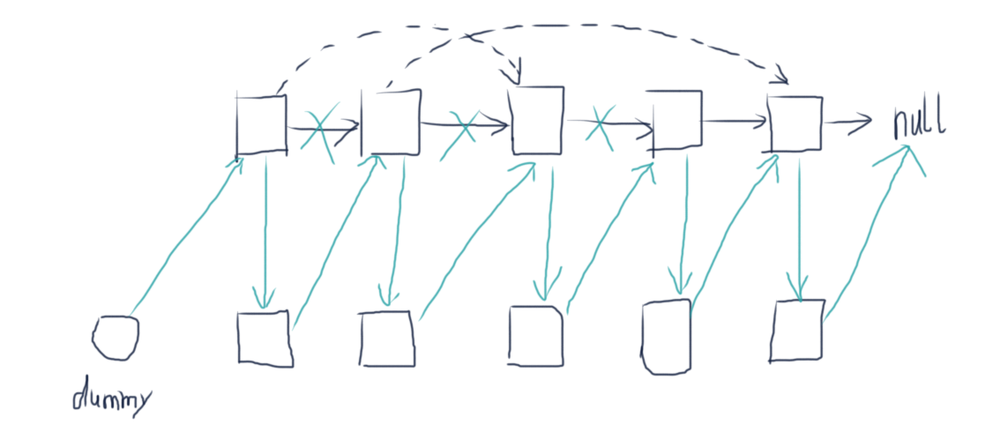
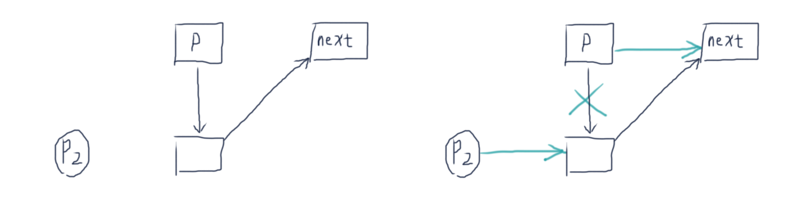

# 复杂链表的复制

输入一个复杂链表（每个节点中有节点值，以及两个指针，一个指向下一个节点，另一个特殊指针指向任意一个节点），返回结果为复制后复杂链表的head。（注意，输出结果中请不要返回参数中的节点引用，否则判题程序会直接返回空）

## Solution

- 方法一：HashMap (oldNode → newNode)

```java
/*
public class RandomListNode {
    int label;
    RandomListNode next = null;
    RandomListNode random = null;

    RandomListNode(int label) {
        this.label = label;
    }
}
*/
import java.util.Map;
import java.util.HashMap;

public class Solution {
    
    public RandomListNode Clone(RandomListNode pHead) {
        RandomListNode dummy = new RandomListNode(0);
        Map<RandomListNode, RandomListNode> map = new HashMap<>();
        
        // clone next pointers
        RandomListNode p = pHead, p2 = dummy;
        while (p != null) {
            p2.next = new RandomListNode(p.label);
            p2 = p2.next;
            map.put(p, p2);
            p = p.next;
        }
        
        // clone random pointers
        p = pHead; p2 = dummy.next;
        while (p != null) {
            p2.random = map.get(p.random);
            p = p.next;
            p2 = p2.next;
        }
        
        return dummy.next;
    }
}
```

其实大可不必使用dummy node，因为map里保存了新创建节点的reference。可以第一遍只创建新节点并保存到map，到第二遍再创建next和random pointers.

```java
import java.util.HashMap;

public class Solution {
    public RandomListNode Clone(RandomListNode pHead) {
        HashMap<RandomListNode, RandomListNode> map = new HashMap<>();
        
        // first pass: create new nodes and put into map
        RandomListNode p = pHead;
        while (p != null) {
            map.put(p, new RandomListNode(p.label));
            p = p.next;
        }
        
        // second pass: make links
        p = pHead;
        while (p != null) {
            RandomListNode copy = map.get(p);
            copy.next = map.get(p.next);
            copy.random = map.get(p.random);
            p = p.next;
        }
        return map.get(pHead);
    }
}
```

> 另一种遍历链表的写法：
>
> ```java
> for (RandomListNode p=pHead; p!=null; p=p.next) {
> 		// ...
> }
> ```
>
> 使用while写法容易忘记 p=p.next 这一句。

- 方法二：next指针之字形关联



So, for a given node `p` in the original list, we can access its copy via `p.next` . This does what the HashMap did in the first method. This is how we save space.

```java
public class Solution {
    public RandomListNode Clone(RandomListNode pHead) {
        // first pass: clone and relink next pointers
        RandomListNode p = pHead;
        while (p != null) {
            RandomListNode next = p.next;
            RandomListNode copy = new RandomListNode(p.label);
            p.next = copy;
            copy.next = next;
            
            p = next;
        }
        
        // second pass: clone random pointers
        p = pHead;
        while (p != null) {
            if (p.random != null) p.next.random = p.random.next;
            
            p = p.next.next;
        }
        
        // third pass: restore links and get the cloned list
        p = pHead;
        RandomListNode dummy = new RandomListNode(0);
        RandomListNode p2 = dummy;
        while (p != null) {
            RandomListNode next = p.next.next;
            p2.next = p.next;
            p.next = next;
            
            p = next;
            p2 = p2.next;
        }
        return dummy.next;
    }
}
```

Third pass中恢复next指针时，使p2始终在p的前一格有一个好处——就是不用单独讨论原链表为空的情况，而且也不需要单独设置dummy.next = pHead.

