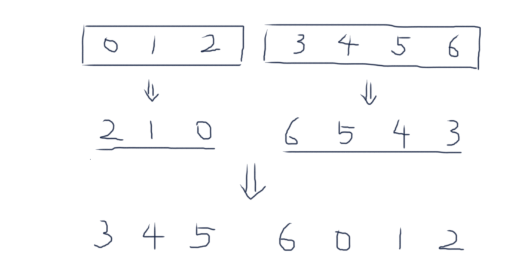

# 左旋转字符串

对于一个给定的字符序列S，请你把其循环左移K位后的序列输出。例如，字符序列S=”abcXYZdef”,要求输出循环左移3位后的结果，即“XYZdefabc”。

## Solution

- 方法一

```java
public class Solution {
    public String LeftRotateString(String str, int k) {
        if (str==null || str.length()==0) return str;
        int n = str.length();
        
        k = k % n;
        StringBuilder sb = new StringBuilder();
        // str[k, n)
        for (int i=k; i<n; i++) {
            sb.append(str.charAt(i));
        }
        // str[0, k)
        for (int i=0; i<k; i++) {
            sb.append(str.charAt(i));
        }
        return sb.toString();
    }
}
```

- 方法二：三步翻转法

$(A^R || B^R)^R = B||A​$ 

例如：



```java
public class Solution {
    public String LeftRotateString(String str, int k) {
        if (str==null || str.equals("")) return str;
        
        int n = str.length();
        k = k % n;
        char[] A = str.toCharArray();
        
        reverse(A, 0, k-1);
        reverse(A, k, n-1);
        reverse(A, 0, n-1);
        return new String(A);
    }
    
    private void reverse(char[] A, int start, int end) {
        int i = start, j = end;
        while (i < j) {
            // swap A[i] and A[j]
            char tmp = A[i];
            A[i] = A[j];
            A[j] = tmp;
            
            i++; j--;
        }
    }
}
```

