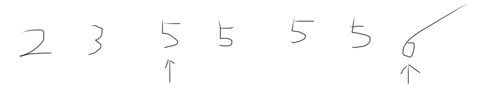

# 数字在排序数组中出现的次数

统计一个数字在排序数组中出现的次数。例如：

Input: A = [2 3 5 5 5 5 6 8]	k = 5

Output: 4

## Example



## Solution

- 方法一

```java
public class Solution {
    public int GetNumberOfK(int [] array , int k) {
        // 查找 k-0.5 的插入位置，即是第一个k的位置
        int left = getInsertPosition(array, k-0.5);
        
        // 查找 k+0.5 的插入位置，即是最后一个k的右边一位
        int right = getInsertPosition(array, k+0.5);
        
        return right-left;
    }
    
    private int getInsertPosition(int[] array, double target) {
        int low=0, high=array.length-1;
        while (low <= high) {
            int mid = (low+high)/2;
            if (array[mid] < target) low=mid+1;
            else high=mid-1;
        }
        return low;
    }
}
```

- 方法二

```java
public class Solution {
    public int GetNumberOfK(int [] array , int k) {
        // [left, right)
        int left = getLeft(array, k);
        int right = getRight(array, k);
        return right-left;
    }
    
    private int getLeft(int[] array, int k) {
        int low=0, high=array.length-1;
        while (low <= high) {
            int mid = (low+high)/2;
            if (array[mid] == k) {
                if (mid==0 || array[mid-1] < array[mid]) return mid;
                else high = mid-1;
            } else if (array[mid] < k) {
                low = mid+1;
            } else {
                high = mid-1;
            }
        }
        return -1;
    }
    
    private int getRight(int[] array, int k) {
        int low=0, high=array.length-1;
        while (low <= high) {
            int mid = (low+high)/2;
            if (array[mid] == k) {
                if (mid==array.length-1 || array[mid+1] > array[mid]) return mid+1;
                else low = mid+1;
            } else if (array[mid] < k) {
                low = mid+1;
            } else {
                high = mid-1;
            }
        }
        return -1;
    }
}
```

注意这里之所以采用左闭右开`[left, right)`而非两边都闭合，是因为如果采用两边都闭合的方式（长度则为right-left+1），假如k压根不存在于array里，`getLeft()`和`getRight()`都将返回-1，那么最后计算结果将是$(-1) - (-1) +1 = 1$，但正确结果应该是0. 而采用左闭右开的方式（长度为right-left）就可以有效避免这种情况。