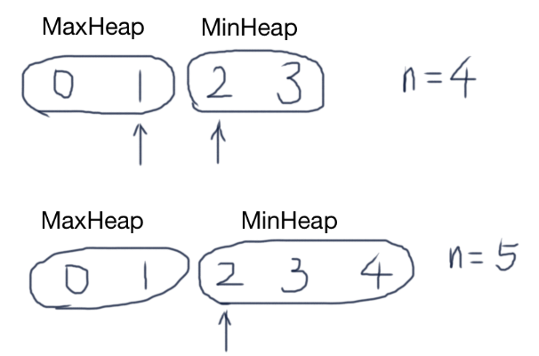

# 数据流中的中位数

如何得到一个数据流中的中位数？如果从数据流中读出奇数个数值，那么中位数就是所有数值排序之后位于中间的数值。如果从数据流中读出偶数个数值，那么中位数就是所有数值排序之后中间两个数的平均值。我们使用Insert()方法读取数据流，使用GetMedian()方法获取当前读取数据的中位数。

## Solution

- 方法一：维护一个排序的数组

```java
import java.util.ArrayList;

public class Solution {
    private ArrayList<Integer> list = new ArrayList<>();
    
    public void Insert(Integer num) {
        if (list.isEmpty()) {
            list.add(num);
            return;
        }
        
        for (int i=list.size()-1; i>=0; i--) {
            if (i==0 || list.get(i-1) <= num) {
                list.add(i, num);
                break;
            }
        }
    }

    public Double GetMedian() {
        int n = list.size();
        if (n % 2 != 0) {
            return list.get(n/2) * 1.0;
        } else {
            return (list.get(n/2-1) + list.get(n/2)) / 2.0;
        }
    }
}
```

- 方法二：最大堆最小堆



用MaxHeap存储“左边”的数据（较小），用MinHeap存储“右边”的数据（较大）。右边MinHeap中的最小值都要比左边MaxHeap中的最大值要大（或相等）。

当size为偶数时，插入到左边MaxHeap👈，然后把MaxHeap根节点（最大值）插入到右边👉MinHeap中。

当size为奇数时，插入到右边👉MinHeap，然后把MinHeap根节点（最小值）插入到左边MaxHeap👈中。

GetMedian：如果size为奇数，中位数就是MinHeap的根节点；如果size为偶数时，中位数就是两个堆首元素的平均值。

```java
import java.util.*;

public class Solution {

    private PriorityQueue<Integer> maxHeap = new PriorityQueue<>(Collections.reverseOrder());
    private PriorityQueue<Integer> minHeap = new PriorityQueue<>();
    private int size = 0;
    
    public void Insert(Integer num) {
        if (size++ % 2 == 0) {
            maxHeap.offer(num);
            minHeap.offer(maxHeap.poll());
        } else {
            minHeap.offer(num);
            maxHeap.offer(minHeap.poll());
        }
    }

    public Double GetMedian() {
        if (size % 2 == 0) {
            return (maxHeap.peek() + minHeap.peek()) / 2.0;
        } else {
            return minHeap.peek() * 1.0;
        }
    }
}
```

