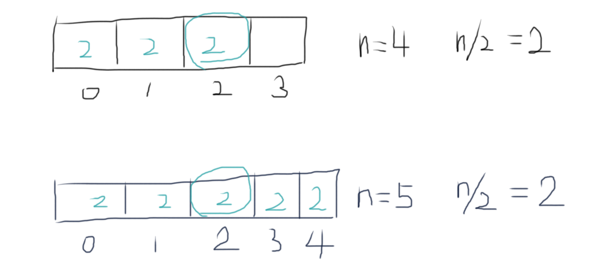

# 数组中出现次数超过一半的数字

数组中有一个数字出现的次数超过数组长度的一半，请找出这个数字。例如输入一个长度为9的数组{1,2,3,2,2,2,5,4,2}。由于数字2在数组中出现了5次，超过数组长度的一半，因此输出2。如果不存在则输出0。

## Solution

- 方法一：HashMap ( Time: $O(n)$, Space: $O(n)$ )

```java
import java.util.HashMap;

public class Solution {
    public int MoreThanHalfNum_Solution(int[] nums) {
        HashMap<Integer, Integer> map = new HashMap<>();
        for (int num : nums) {
            int count = map.getOrDefault(num, 0);
            count++;
            if (count > nums.length/2) return num;
            map.put(num, count);
        }
        return 0;
    }
}
```

- 方法二：Sort ( Time: $O(nlogn)$, Space: $O(1)$ )

```java
import java.util.Arrays;

public class Solution {
    public int MoreThanHalfNum_Solution(int[] nums) {
        int n = nums.length;
        
        Arrays.sort(nums);
        
        int num = 0, count = 0;
        for (int i=0; i<n; i++) {
            if (nums[i] == num) {
                count++;
            } else {
                num = nums[i];
                count = 1;
            }
            
            if (count > n/2) return num;
        }
        return 0;
    }
}
```

- 方法三：partition ( Time: $O(n)$, Space: $O(1)$ )

Let k = n/2. If there exists such a number, then the $k^{th}$ element (0-based) must also be this number.



But how to determine whether it exists or not? Known $k^{th}$ element, just traverse the array to count its occurrence.

```java
public class Solution {
    public int MoreThanHalfNum_Solution(int[] nums) {
        int n = nums.length;
        int k = n/2;
        
        int e = getKthElement(nums, k, 0, n-1);
        
        // verify
        int count = 0;
        for (int num : nums) {
            if (num == e) count++;
        }
        return (count > n/2)? e : 0;
    }
    
    private int getKthElement(int[] nums, int k, int p, int q) {
        int r = partition(nums, p, q);
        
        if (r == k) return nums[k];
        if (r > k) return getKthElement(nums, k, p, r-1);
        else return getKthElement(nums, k, r+1, q);
    }
    
    // A[p..r) always ≤ pivot
    // Init: r = p. When found a number that is ≤ pivot, swap to r and then increment r
    private int partition(int[] nums, int p, int q) {
        int r = p;
        int pivot = nums[q];
        
        for (int i=p; i<q; i++) {
            if (nums[i] <= pivot) {
                swap(nums, i, r++);
            }
        }
        // swap pivot to index r
        swap(nums, q, r);
        return r;
    }
    
    private void swap(int[] nums, int i, int j) {
        int tmp = nums[i];
        nums[i] = nums[j];
        nums[j] = tmp;
    }
}
```

> getKthElement()也可以写成iterative.
>
> ```java
> 		private int getKthElement(int[] nums, int k) {
>         int low=0, high=nums.length-1;
>         while (true) {
>             int r = partition(nums, low, high);
>             if (r == k) return nums[r];
>             if (r < k) low=r+1;
>             else high=r-1;
>         }
>     }
> ```
>
> 