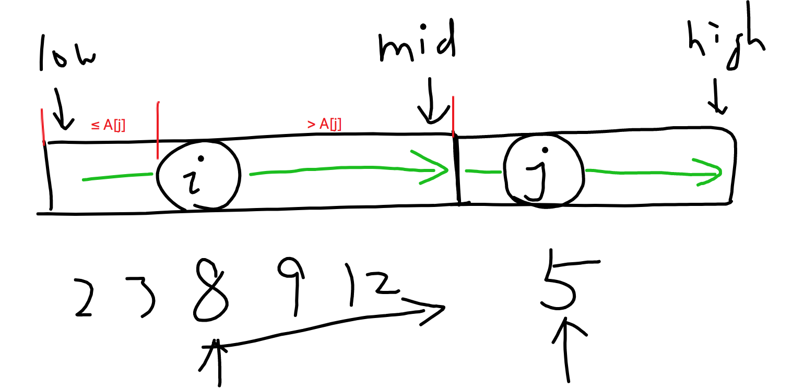

# 数组中的逆序对

在数组中的两个数字，如果前面一个数字大于后面的数字，则这两个数字组成一个逆序对。输入一个数组,求出这个数组中的逆序对的总数P。并将P对1000000007取模的结果输出。 即输出P%1000000007

> ```
> 题目保证输入的数组中没有的相同的数字数据范围：
> 	对于%50的数据,size<=10^4
> 	对于%75的数据,size<=10^5
> 	对于%100的数据,size<=2*10^5
> ```

示例：

```
Input: [1,2,3,4,5,6,7,0]
Output: 7
```

## Solution

- 方法一：Bruteforce ($O(n^2)$, Time Limit Exceeded)

```java
public class Solution {
    public int InversePairs(int[] nums) {
        int n = nums.length;
        final int MAX = 1000000007;

        int count = 0;
        for (int i=0; i<n; i++) {
            for (int j=i+1; j<n; j++) {
                if (nums[i] > nums[j]) {
                    count++;
                    count %= MAX;
                }
            }
        }
        return count % MAX;
    }
}
```

- 方法二：Divide and Conquer ( $O(nlogn)$ )

可以直接使用MergeSort并对逆序对进行计数。递归调用之后两边的array都是sorted，对于A[j]来说，$i$ 从最左边向右移动一直到某个数A[i] > A[j]，这时我们可以计算左边数组中有多少个元素与A[j]是逆序对—— $i$ 左边的元素都比它小，所以跟A[j]不是逆序对，$i$ 以及其右边的元素直到A[mid]都比A[j]大（因为左右数组都是sorted），所以跟A[j]是逆序对，一共有 `mid-i+1` 个。接着A[j]被选取并且`j`右移一位，继续计算左侧数组中与A[j]形成逆序对的有多少。



```java
public class Solution {
    
    private int count = 0;
    private final int N = 1000000007;
    
    public int InversePairs(int[] nums) {
        mergeSort(nums, 0, nums.length-1);
        return count % N;
    }
    
    private void mergeSort(int[] nums, int low, int high) {
        if (low >= high) return;
        
        int mid = (low + high) / 2;
        mergeSort(nums, low, mid);
        mergeSort(nums, mid+1, high);
        // merge
        int[] tmp = new int[high-low+1];
        int index = 0;
        int i = low, j = mid+1;
        
        while (i <= mid && j <= high) {
            if (nums[i] <= nums[j]) {
                tmp[index++] = nums[i++];
            } else {
                tmp[index++] = nums[j++];
                count += (mid-i+1);
                count %= N;
            }
        }
        
        while (i <= mid) {
            tmp[index++] = nums[i++];
        }
        
        while (j <= high) {
            tmp[index++] = nums[j++];
        }
        
        // copy back
        index = 0;
        for (int k=low; k<=high; k++) {
            nums[k] = tmp[index++];
        }
    }
}
```

