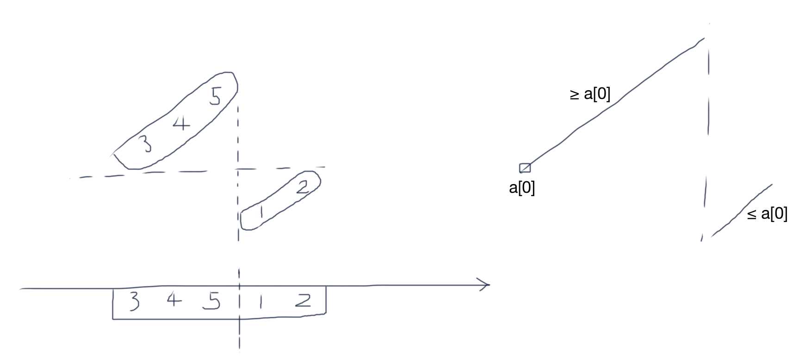

# 旋转数组的最小数字

把一个数组最开始的若干个元素搬到数组的末尾，我们称之为数组的旋转。 输入一个非减排序的数组的一个旋转，输出旋转数组的最小元素。 例如数组{3,4,5,1,2}为{1,2,3,4,5}的一个旋转，该数组的最小值为1。 **NOTE：给出的所有元素都大于0**，若数组大小为0，请返回0。

## Idea

可以看作是LeetCode [33.SearchinRotatedSortedArray](/Array/33.SearchinRotatedSortedArray.md) 的变形，这里因为数组中所有元素都大于0，那么0的插入位置(insert position)即是数组中最小值所在的位置。



## Solution

```java
import java.util.ArrayList;
public class Solution {
    
    public int minNumberInRotateArray(int [] nums) {
        int target = 0;
        
        int low=0, high=nums.length-1;
        while (low <= high) {
            int mid = (low + high) / 2;
            int num;    // the de facto midValue
            if ((nums[mid] < nums[0]) == (target < nums[0])) {    // `nums[mid]` and `target` on the same side
                num = nums[mid];
            } else {					// `nums[mid]` and `target` on different sides
                num = (nums[mid] < nums[0])? Integer.MAX_VALUE : Integer.MIN_VALUE;
            }
            
            if (num == target) return num;
            if (num < target) low = mid+1;
            else high = mid-1;
        }
        
        return nums[low];
    }
}
```

注解：当`nums[mid]`和`target`处在不同侧的时候，进一步说，如果nums[mid] < nums[0]，即nums[mid]处在右侧而target在左侧，想要让二分法向左👈查找，在正常的二分法里如果midValue比target大则会向左查找，因此我们给midValue赋值为 Integer.MAX_VALUE 即可，反之同理。