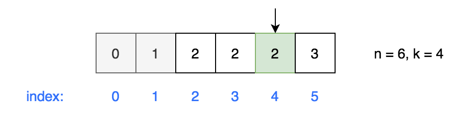

# 最小的K个数

输入n个整数，找出其中最小的K个数。例如输入4,5,1,6,2,7,3,8这8个数字，则最小的4个数字是1,2,3,4,。

## Solution

- 方法一：Sort ( $O(nlogn)$ )

```java
import java.util.ArrayList;
import java.util.Arrays;

public class Solution {
    public ArrayList<Integer> GetLeastNumbers_Solution(int[] input, int k) {
        int n = input.length;
        
        Arrays.sort(input);
        ArrayList<Integer> result = new ArrayList<>();
        if (k > n) return result;
        
        for (int i=0; i<k; i++) {
            result.add(input[i]);
        }
        return result;
    }
}
```

- 方法二：partition ( $O(n)$ )

partition → getKthElement (0-based) → traverse the array and choose numbers that are less than k-th element.

```java
import java.util.ArrayList;

public class Solution {
    public ArrayList<Integer> GetLeastNumbers_Solution(int[] nums, int k) {
        int n = nums.length;
        ArrayList<Integer> result = new ArrayList<>();
        if (k > n) return result;
        if (k == n) {
            for (int num : nums) {
                result.add(num);
            }
            return result;
        }
        
        int kthElement = getKthElement(nums, k, 0, n-1);
        for (int num : nums) {
            if (num < kthElement) {
                result.add(num);
            }
        }
        while (result.size() < k) {    // e.g. [0,1,2,2,2,2,3], k=4
            result.add(kthElement);
        }
        return result;
    }
    
    private int getKthElement(int[] nums, int k, int p, int q) {
        int r = partition(nums, p, q);
        
        if (k == r) return nums[k];
        if (k < r) return getKthElement(nums, k, p, r-1);
        else return getKthElement(nums, k, r+1, q);
    }
    
    // choose the last element A[q] as the pivot
    // Loop Invariant: A[p..r) always ≤ pivot
    // 开始时r=p，如果 A[i] ≤ pivot 则swap A[i]到r的位置并increment r（类似于SelectionSort）
    private int partition(int[] nums, int p, int q) {
        int r = p;
        int pivot = nums[q];
        
        for (int i=p; i<q; i++) {
            if (nums[i] <= pivot) {
                // swap A[i] to index r and increment r
                swap(nums, i, r++);
            }
        }
        
        // swap pivot A[q] to index r
        swap(nums, q, r);
        return r;
    }
    
    private void swap(int[] nums, int i, int j) {
        int tmp = nums[i];
        nums[i] = nums[j];
        nums[j] = tmp;
    }
}
```

注意当kthElement有重复的时候，例如下图所示，result = [0, 1]，需要用kthElement补全，直到result.size()==k.



另外，k是0-based，因此getKthElement()中k要小于n.