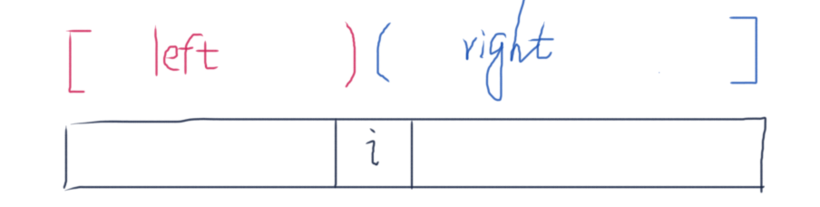

# 构建乘积数组

给定一个数组A[0,1,...,n-1],请构建一个数组B[0,1,...,n-1],其中B中的元素
$$
B[i]=A[0]*A[1]*...*A[i-1]*A[i+1]*...*A[n-1]
$$
不能使用除法。

## Idea



## Solution

```java
public class Solution {
    
    // left[i] = A[0]*A[1]*...*A[i-1]    A[0..i)
    // right[i] = A[i+1]*...*A[n-1]      A(i..n-1]
    // 
    // left[0]=1, left[i] = left[i-1]*A[i-1]
    // right[0]=1, right[i] = right[i+1]*A[i+1]
    // B[i] = left[i]*right[i]
    public int[] multiply(int[] A) {
        int n = A.length;
        int[] B = new int[n];
        if (n == 0) return B;
        
        int[] left = new int[n];
        left[0] = 1;
        for (int i=1; i<n; i++) {
            left[i] = left[i-1] * A[i-1];
        }
        
        int[] right = new int[n];
        right[n-1] = 1;
        for (int i=n-2; i>=0; i--) {
            right[i] = right[i+1] * A[i+1];
        }
        
        for (int i=0; i<n; i++) {
            B[i] = left[i] * right[i];
        }
        return B;
    }
}
```

其实并不需要另外开两个数组，可以先用B[]数组保存left[]，然后再倒过来遍历一遍求right[]并累乘进去。

```java
public class Solution {
    
    // left[i] = A[0]*A[1]*...*A[i-1]    A[0..i)
    // right[i] = A[i+1]*...*A[n-1]      A(i..n-1]
    // 
    // left[0]=1, left[i] = left[i-1]*A[i-1]
    // right[0]=1, right[i] = right[i+1]*A[i+1]
    // B[i] = left[i]*right[i]
    public int[] multiply(int[] A) {
        int n = A.length;
        int[] B = new int[n];
        if (n == 0) return B;
        
        // 先求left[]，用B数组保存
        B[0] = 1;
        for (int i=1; i<n; i++) {
            B[i] = B[i-1] * A[i-1];
        }
        
        // 再求right[]并累乘进B数组
        int right = 1;
        for (int i=n-2; i>=0; i--) {
            right = right * A[i+1];
            B[i] *= right;
        }
        
        return B;
    }
}
```

