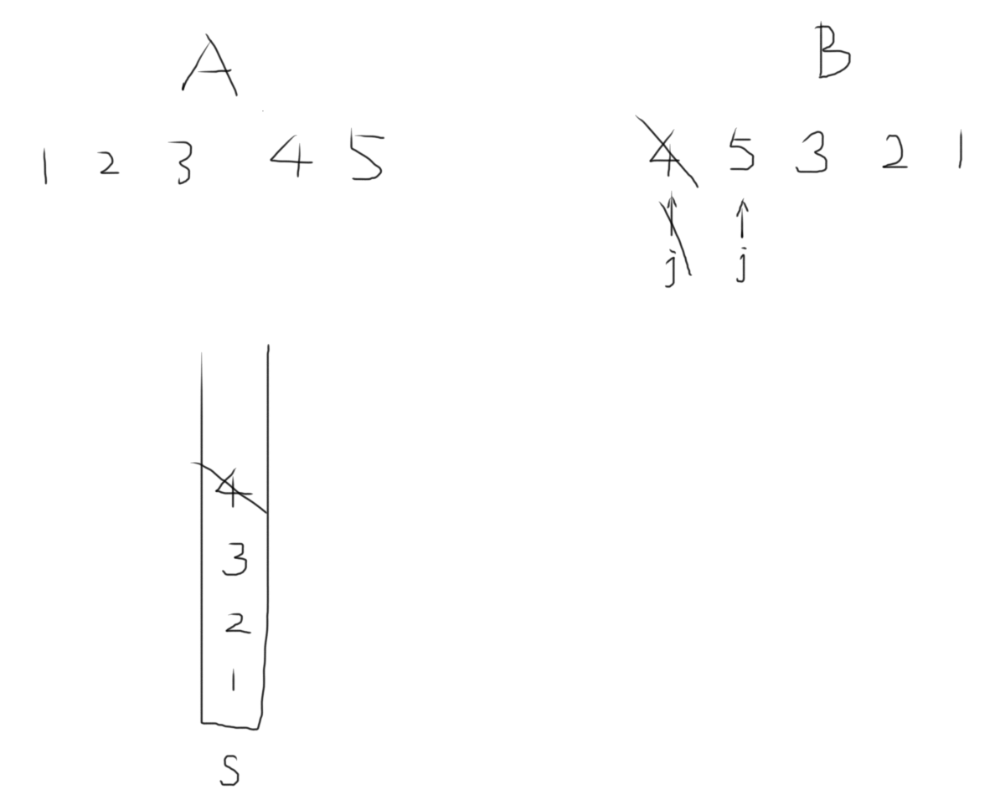

# 栈的压入、弹出序列

输入两个整数序列，第一个序列表示栈的压入顺序，请判断第二个序列是否可能为该栈的弹出顺序。假设压入栈的所有数字均不相等。例如序列1,2,3,4,5是某栈的压入顺序，序列4,5,3,2,1是该压栈序列对应的一个弹出序列，但4,3,5,1,2就不可能是该压栈序列的弹出序列。（注意：这两个序列的长度是相等的）

## Example



## Solution

```java
import java.util.Stack;

public class Solution {
    
    // 一直把A的元素压入栈，如果栈顶元素和B[j]相等了则一直消去（出栈，j++）
    public boolean IsPopOrder(int[] A, int[] B) {
        int n = A.length;
        
        Stack<Integer> s = new Stack<>();
        int j = 0;
        for (int i=0; i<n; i++) {
            s.push(A[i]);
            while (!s.isEmpty() && s.peek()==B[j]) {
                s.pop();
                j++;
            }
        }
        return s.isEmpty();
    }
}
```

