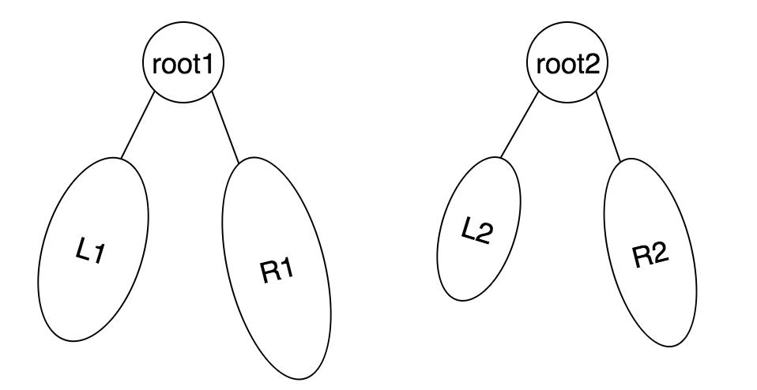

# 树的子结构

输入两棵二叉树A，B，判断B是不是A的子结构。（ps：我们约定空树不是任意一个树的子结构）

## Idea



如果root2是root1的子结构，则有三种情况：

- root2是L1的子结构 （递归调用）
- root2是L2的子结构 （递归调用）
- root2是root1的同根子树

## Solution

```java
/**
public class TreeNode {
    int val = 0;
    TreeNode left = null;
    TreeNode right = null;

    public TreeNode(int val) {
        this.val = val;

    }

}
*/
public class Solution {
    
    public boolean HasSubtree(TreeNode root1,TreeNode root2) {
        if (root1==null || root2==null) return false;
        
        return HasSubtree(root1.left, root2)
            || HasSubtree(root1.right, root2)
            || isSubtreeWithSameRoot(root1, root2);
    }
    
    private boolean isSubtreeWithSameRoot(TreeNode root1, TreeNode root2) {
        if (root2==null) return true;
        if (root1==null) return false;	// root2不为null
        
        return (root1.val==root2.val)
            && isSubtreeWithSameRoot(root1.left, root2.left)
            && isSubtreeWithSameRoot(root1.right, root2.right);
    }
}
```

> 注意约定里空树不是任何树的子结构，因此如果root2==null则返回false，而如果root1==null的话，任何非空子树都不可能是它的子结构，并且null也不是它的字结构，因此也直接返回false。
>
> 当判断是否是同根子树时，已经保证了root1和root2都不为null（如果是的话已经直接返回false），所以并不需要再重复考虑上面的特殊约定（空数不是任何一个树的字结构）。null是任何树的同根子树，因此直接返回true，但root2不为空的情况下如果root1已经为空了，root2肯定不是root1的同根子树，因此返回false。