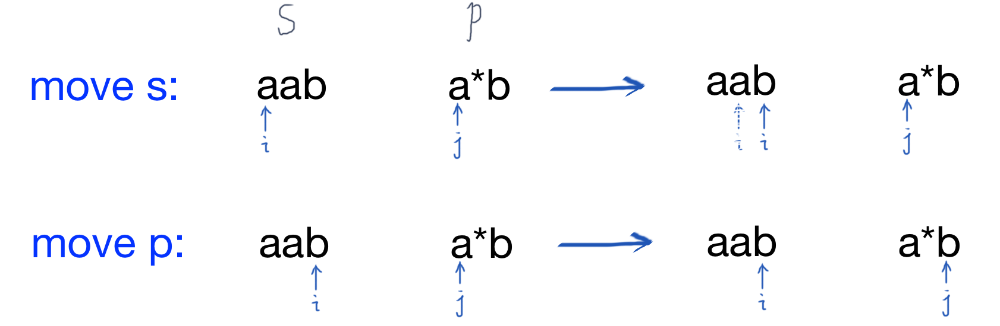

# 正则表达式匹配

请实现一个函数用来匹配包括'.'和'*'的正则表达式。模式中的字符'.'表示任意一个字符，而'*'表示它前面的字符可以出现任意次（包含0次）。 在本题中，匹配是指字符串的所有字符匹配整个模式。例如，字符串`aaa`与模式`a.a`和`ab*ac*a`匹配，但是与`aa.a`和`ab*a`均不匹配

## Solution

- 方法一：Recursion 先看match再看'*'

逻辑是这样的：

1. Base case: 如果pattern为空，那么str也必须为空
2. 如果pattern遇到 `?*` 的情况，我们要么直接跳过这两个pattern字符（即出现0次的情况），要么匹配掉str的一个字符（前提是firstMatch），在下一次匹配时再决定是否跳过pattern字符。



1. 如果下一位不是星号，则执行常规匹配

```java
public class Solution {
    public boolean match(char[] s, char[] p) {
        return helper(s, p, 0, 0);
    }

    private boolean helper(char[] s, char[] p, int i, int j) {
        int n = s.length, m = p.length;
        if (j == m) return i == n;		// If p is empty then s must be empty
        
        boolean firstMatch = (i<n) && (p[j]=='.' || p[j]==s[i]);
        
        if (j<m-1 && p[j+1]=='*') {
            return helper(s, p, i, j+2)
                || (firstMatch && helper(s, p, i+1, j));
        } else {
            return firstMatch && helper(s, p, i+1, j+1);
        }
    }
}
```

- 方法二：Dynamic Programming

上面的方法求解中存在重叠的子问题，所以可以存储中间结果来加速计算。

**Top-Down Approach**

```java
public class Solution {
    public boolean match(char[] s, char[] p) {
        Boolean[][] memo = new Boolean[s.length+1][p.length+1];
        return helper(s, p, 0, 0, memo);
    }

    private boolean helper(char[] s, char[] p, int i, int j, Boolean[][] memo) {
        int n = s.length, m = p.length;
        if (j == m) return i == n;
        
        if (memo[i][j] != null) return memo[i][j];
        
        boolean firstMatch = (i<n) && (p[j]=='.' || p[j]==s[i]);
        
        if (j<m-1 && p[j+1]=='*') {
            memo[i][j] = helper(s, p, i, j+2, memo)
                || (firstMatch && helper(s, p, i+1, j, memo));
        } else {
            memo[i][j] = firstMatch && helper(s, p, i+1, j+1, memo);
        }
        return memo[i][j];
    }
}
```

**Bottom-Up Approach**

```java
public class Solution {
    public boolean match(char[] s, char[] p) {
        int n = s.length, m = p.length;
        boolean[][] dp = new boolean[n+1][m+1];
        dp[n][m] = true;
        
        for (int i=n; i>=0; i--) {
            for (int j=m-1; j>=0; j--) {
                boolean firstMatch = (i<n) && (p[j]=='.' || p[j]==s[i]);
                if (j<m-1 && p[j+1]=='*') {
                    dp[i][j] = dp[i][j+2] || (firstMatch && dp[i+1][j]);
                } else {
                    dp[i][j] = firstMatch && dp[i+1][j+1];
                }
            }
        }
        return dp[0][0];
    }
}
```

