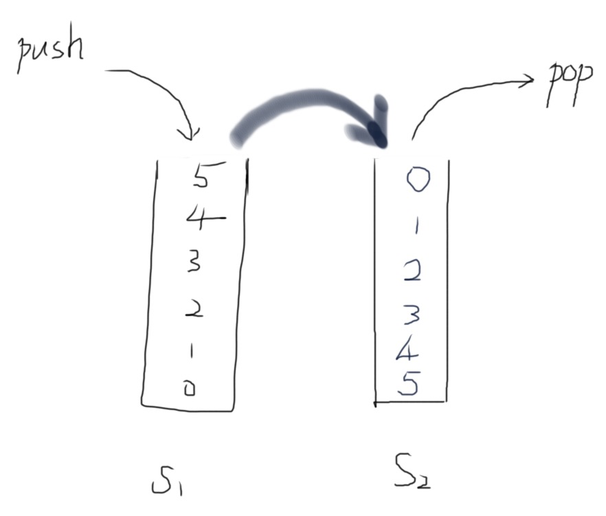

# 用两个栈实现队列

用两个栈来实现一个队列，完成队列的Push和Pop操作。 队列中的元素为int类型。

## Idea



[负负得正] Always push to `stack1` and pop from `stack2`. But in case that `stack2` is empty, move all elements from `stack1` to `stack2` then pop again (from `stack2`).

## Solution

```java
import java.util.Stack;

public class Solution {
    Stack<Integer> stack1 = new Stack<>();
    Stack<Integer> stack2 = new Stack<>();
    
    public void push(int node) {
        stack1.push(node);
    }
    
    public int pop() {
        if (stack2.isEmpty()) {
            // move all elements from stack1 to stack2
            while (!stack1.isEmpty()) {
                stack2.push(stack1.pop());
            }
        }
        return stack2.pop();
    }
}
```