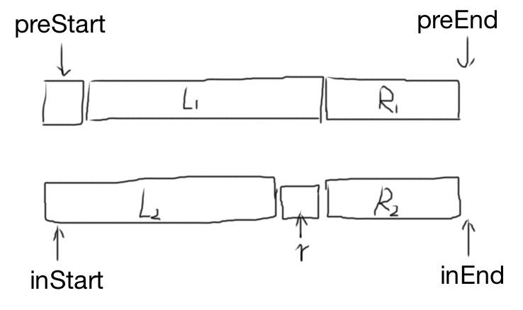

# Reconstruct Binary Tree From Preorder and Inorder

输入某二叉树的前序遍历和中序遍历的结果，请重建出该二叉树。假设输入的前序遍历和中序遍历的结果中都不含重复的数字。例如输入前序遍历序列{1,2,4,7,3,5,6,8}和中序遍历序列{4,7,2,1,5,3,8,6}，则重建二叉树并返回。

## Idea



Pre-order: `root`,  left,  right

In-order:    left,  `root`, right

因此，Pre-order的第一个元素就是root节点，然后在In-order里找出root的位置，记为r，这样就知道了左子树的长度 leftLen = r - inStart. 递归调用，使用L1和L2构建左子树，使用R1和R2构建右子树。

## Solution

```java
/**
 * Definition for binary tree
 * public class TreeNode {
 *     int val;
 *     TreeNode left;
 *     TreeNode right;
 *     TreeNode(int x) { val = x; }
 * }
 */
public class Solution {
    public TreeNode reConstructBinaryTree(int[] pre, int[] in) {
        return helper(pre, in, 0, pre.length, 0, in.length);
    }
    
    // [Start, End)
    private TreeNode helper(int[] pre, int[] in, int preStart, int preEnd, int inStart, int inEnd) {
        if (preEnd <= preStart) return null;

        // pre[preStart] is the root
        int root = pre[preStart];

        // find the position of root in `in`
        int r = inStart;
        while (in[r] != root) r++;

        TreeNode rootNode = new TreeNode(root);

        int leftLen = r - inStart;
        int preMid = preStart+leftLen+1;
        rootNode.left = helper(pre, in, preStart+1, preMid, inStart, r);
        rootNode.right = helper(pre, in, preMid, preEnd, r+1, inEnd);

        return rootNode;
    }
}
```

