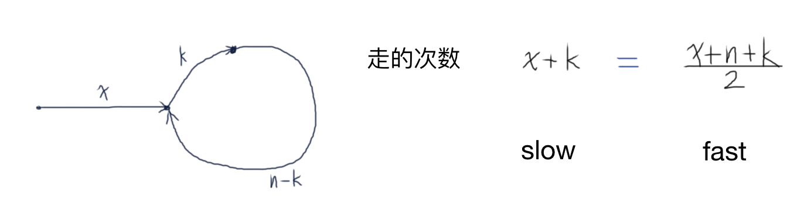

# 链表中环的入口结点

给一个链表，若其中包含环，请找出该链表的环的入口结点，否则，输出null。

## Solution

- 方法一：HashSet

```java
import java.util.HashSet;
public class Solution {

    public ListNode EntryNodeOfLoop(ListNode pHead) {
        if (pHead == null) return null;
        
        HashSet<ListNode> set = new HashSet<>();
        ListNode p = pHead;
        while (p != null) {
            if (!set.add(p)) {
                return p;
            }
            p = p.next;
        }
        return null;
    }
}
```

- 方法二：Two-Pointers (*Fast-Slow Pointers*)

可以使用两个指针：fast指针每次走两步，slow指针每次走一步。如果fast指针走到了null或者fast.next==null则说明链表没有环；如果链表确实有环，两个指针必然在环内相遇。设环的长度为n，环之外的长度为x，相遇时慢指针在环中走了k步，那么慢指针走的步数为x+k，快指针走的步数为x+n+k（转一圈后继续走k步），虽然两指针走的速度不同，但走的次数相同，即 x+k = (x+n+k)/2，化简 x+k=n，即：x = n-k.



因此，在相遇点把一个指针重新放到表头，然后两个指针每次都走一步，因为x = n-k，所以两个指针再次相遇的点就是环的入口节点。

```java
public class Solution {

    public ListNode EntryNodeOfLoop(ListNode pHead) {
        ListNode fast = pHead, slow = pHead;
        do {
            if (fast==null || fast.next==null) return null;
            fast = fast.next.next;
            slow = slow.next;
        } while (fast != slow);
        
        fast = pHead;
        while (fast != slow) {
            fast = fast.next;
            slow = slow.next;
        }
        return fast;
    }
}
```

> 延伸：如果要求环的长度，只需要用一个指针从相遇点出发，当再次到达该点的时候就是绕环走了一圈，记下走过的步数即可。如果已求的环的长度为n，想要继续求整个链表的长度，可以把在表头设两个指针，每个指针每次都只走一步，其中一个指针先走n步，然后两个指针以相同的速度向前移动，直到它们相遇，相遇的节点正好是环的入口节点，因为这时第一个指针走了n+x步，第二个指针走了x步，都在入口节点。