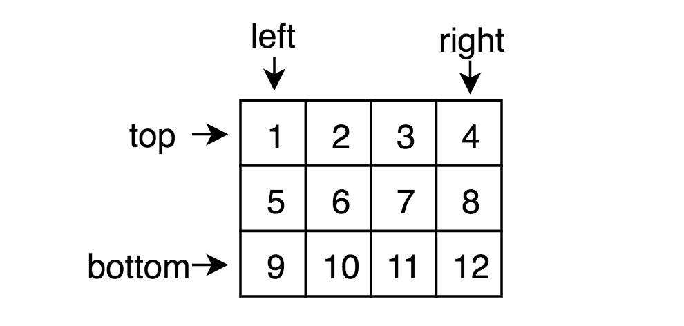

# 顺时针打印矩阵

输入一个矩阵，按照从外向里以顺时针的顺序依次打印出每一个数字，例如，如果输入如下4 X 4矩阵： 1 2 3 4 5 6 7 8 9 10 11 12 13 14 15 16 则依次打印出数字1,2,3,4,8,12,16,15,14,13,9,5,6,7,11,10.

> ⚠️注意“矩阵”和“方阵”的区别。

## Idea

本题如果corner case处理不好则极易出错。一个可行的办法是：计算第 $i$ 圈的一周元素的坐标范围，但 $i​$ 的取值范围不好确定并且很容易出错。

我们可以使用 `top`, `bottom`, `left`, `right` 四个变量来标记这个矩形的四个边界，遍历最上面的一整行然后top++，遍历最右面的一整列然后right--，遍历最下面的一整行然后bottom--， 遍历最左边的一整列然后left++。



## Solution

```java
import java.util.ArrayList;
public class Solution {
    
    public ArrayList<Integer> printMatrix(int [][] matrix) {
        ArrayList<Integer> list = new ArrayList<>();
        int m = matrix.length;
        if (m==0) return list;
        int n = matrix[0].length;

        int top=0, bottom=m-1, left=0, right=n-1;
        while (top<=bottom && left<=right) {
            for (int j=left; j<=right; j++) {
                list.add(matrix[top][j]);
            }
            top++;      // 从上面消去一行

            for (int i=top; i<=bottom; i++) {
                list.add(matrix[i][right]);
            }
            right--;    // 从右边消去一列

            if (top<=bottom) {
                for (int j=right; j>=left; j--) {
                    list.add(matrix[bottom][j]);
                }
                bottom--;   // 从下面消去一行
            }

            if (left<=right) {
                for (int i=bottom; i>=top; i--) {
                    list.add(matrix[i][left]);
                }
                left++;     // 从左边消去一列
            }
        }

        return list;
    }
}
```

⚠️注意循环里依然有corner case，就是只剩下单行或单列的时候，比如当top==bottom时，遍历完这一行后top++，显然已经不满足top<=bottom的条件，但本次while循环还没结束不会执行判断，则遍历bottom那一行时又会遍历一遍这行数，一列数同理。因此需要在 `←` 和 `↑`遍历之前再次执行相应判断。