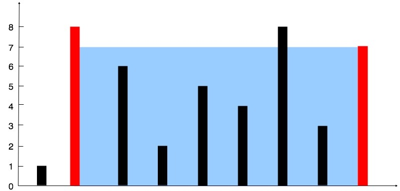

# 11. Container With Most Water

Given n non-negative integers a1, a2, ..., an , where each represents a point at coordinate (i, ai). n vertical lines are drawn such that the two endpoints of line i is at (i, ai) and (i, 0). Find two lines, which together with x-axis forms a container, such that the container contains the most water.

Note: You may not slant the container and n is at least 2.



The above vertical lines are represented by array [1,8,6,2,5,4,8,3,7]. In this case, the max area of water (blue section) the container can contain is 49.

Example:

```
Input: [1,8,6,2,5,4,8,3,7]
Output: 49
```

# Solution

```java
    // 穷举法 O(n^2)
    static int maxArea(int[] height) {
        int maxS = 0;

        for (int i=0; i<height.length-1; i++) {
            for (int j=i+1; j<height.length; j++) {
                int S = (j-i) * Math.min(height[i], height[j]);
                if (S > maxS) maxS = S;
            }
        }
        return maxS;
    }

    // 每次移动最短的线 O(n)
    static int maxArea2(int[] height) {
        int maxS = 0;

        int i = 0, j = height.length-1;
        while (i < j) {
            int S = (j-i) * Math.min(height[i], height[j]);
            if (S > maxS) maxS = S;
            if (height[i] < height[j])
                i++;
            else
                j--;
        }
        return maxS;
    }
```

[Read more](https://leetcode.com/problems/container-with-most-water/solution/)