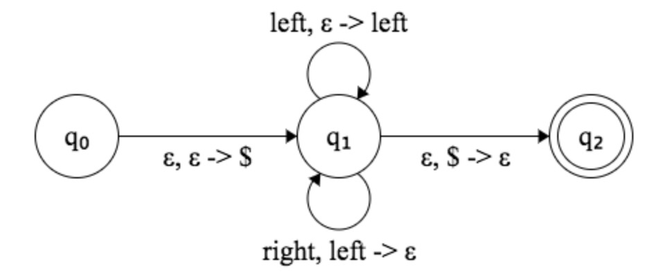

# 20. Valid Parentheses

Given a string containing just the characters '(', ')', '{', '}', '[' and ']', determine if the input string is valid.

An input string is valid if:

Open brackets must be closed by the same type of brackets.
Open brackets must be closed in the correct order.
Note that an empty string is also considered valid.

Example 1:

```
Input: "()"
Output: true
```

Example 2:

```
Input: "()[]{}"
Output: true
```

Example 3:

```
Input: "(]"
Output: false
```

Example 4:

```
Input: "([)]"
Output: false
```

Example 5:

```
Input: "{[]}"
Output: true
```

# Idea



- Read `left`, push `left`
- Read `right`, match `left`

# Solution

```java
    // - Read `left`, push `left`
    // - Read `right`, match `left`
    static boolean isValid(String s) {
        String left = "([{";
        String right = ")]}";

        int n = s.length();
        Stack<Character> stack = new Stack<>();

        for (int i=0; i<n; i++) {
            char c = s.charAt(i);

            // left
            if (left.indexOf(c) != -1) {
                stack.push(c);
                continue;
            }

            // right
            if (stack.isEmpty() || right.indexOf(c) != left.indexOf(stack.pop())) {
                return false;
            }
        }
        return stack.isEmpty();
    }
```
