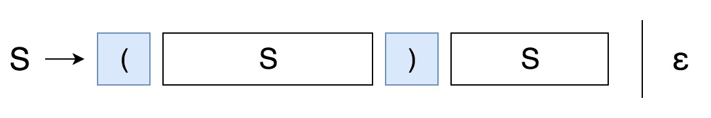

# 22. Generate Parentheses

Given n pairs of parentheses, write a function to generate all combinations of well-formed parentheses.

For example, given n = 3, a solution set is:

```
[
  "((()))",
  "(()())",
  "(())()",
  "()(())",
  "()()()"
]
```

# Solution1: Backtracking

```java
    // 方法一：Backtracking
    // We can do this by keeping track of the number of opening and closing brackets we have placed so far.
    // 每一次递归都有两种选择：添加左括号 vs 添加右括号。只有当`open < n`时能添加左括号很好理解；
    // 而只有当`close < open`时才能添加右括号是因为：右括号必须在其左边寻找左括号进行匹配，假如左边已经有相同个数的
    // 左括号和右括号，如`()()`，这时如果再添加一个右括号，则变成`()())`，之后再添加多少个左括号都不可能与它进行匹配
    static List<String> generateParenthesis(int n) {
        List<String> result = new ArrayList<>();
        backtrack("", 0, 0, result, n);
        return result;
    }

    private static void backtrack(String prefix, int openSoFar, int closeSoFar, List<String> result, int n) {
        if (prefix.length() == n*2) {
            result.add(prefix);
            return;
        }

        // We can start an opening bracket if we still have one (of n) left to place.
        if (openSoFar < n) {
            backtrack(prefix+"(", openSoFar+1, closeSoFar, result, n);
        }
        // And we can start a closing bracket if it would not exceed the number of opening brackets.
        if (closeSoFar < openSoFar) {
            backtrack(prefix+')', openSoFar, closeSoFar+1, result, n);
        }
    }
```

# Solution2: Closure Number



```java
    // 方法二：Closure Number
    // Grammar: S -> (S)S | ε
    static List<String> generateParenthesis2(int n) {
        List<String> result = new ArrayList<>();
        if (n == 0) {
            result.add("");
            return result;
        }

        for (int i=0; i<n; i++) {
            for (String left : generateParenthesis2(i)) {
                for (String right: generateParenthesis2(n-1-i)) {
                    String s = "(" + left + ")" + right;
                    result.add(s);
                }
            }
        }
        return result;
    }
```