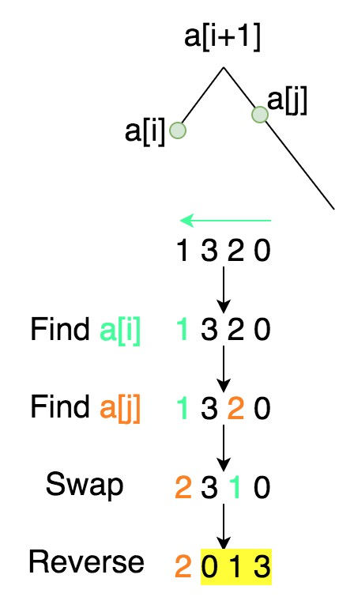

# 31. Next Permutation

Implement `next permutation`, which rearranges numbers into the lexicographically next greater permutation of numbers.

If such arrangement is not possible, it must rearrange it as the lowest possible order (ie, sorted in ascending order).

The replacement must be in-place and use only constant extra memory.

Here are some examples. Inputs are in the left-hand column and its corresponding outputs are in the right-hand column.

```
1,2,3 → 1,3,2
3,2,1 → 1,2,3
1,1,5 → 1,5,1
```

# Idea

题目是让寻找比当前数大的下一个排列，如果已经是最大的了，就返回第一个排列。比如123，其所有排列为 123，132，213，231，312，321。如果输入是123则返回132；如果输入是321则返回123。

解题的过程如下：



# Solution

```java
    // 例如：1320 -> 2013
    public void nextPermutation(int[] nums) {
        int i = nums.length - 2;

        // 从右向左直到找到一个i使得 a[i] < a[i+1]，如`13`
        while (i>=0 && nums[i] >= nums[i+1]) i--;

        // 如果到了最左边，即所有数字都是递减的（如`4321`），则直接reverse并返回
        if (i == -1) {
            reverse(nums, i+1);
            return;
        }

        // 找到刚好大于a[i]的位置a[j]
        int j = nums.length-1;
        while (nums[j] <= nums[i]) j--;
        // 交换a[j]到a[i]
        swap(nums, i, j);
        // reverse a[i] 右边的
        reverse(nums, i+1);
    }

    private void reverse(int[] nums, int start) {
        int i=start, j=nums.length-1;
        while (i < j) {
            swap(nums, i, j);
            i++; j--;
        }
    }

    private void swap(int[] nums, int i, int j) {
        int tmp = nums[i];
        nums[i] = nums[j];
        nums[j] = tmp;
    }
```