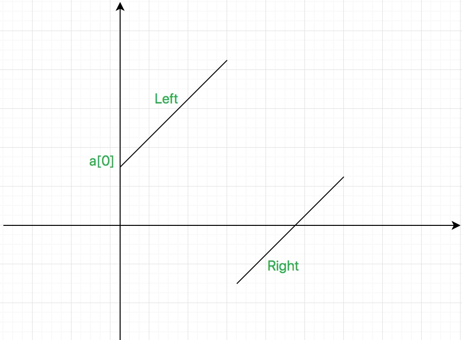

# 33. Search in Rotated Sorted Array

Suppose an array sorted in ascending order is rotated at some pivot unknown to you beforehand.

(i.e., [0,1,2,4,5,6,7] might become [4,5,6,7,0,1,2]).

You are given a target value to search. If found in the array return its index, otherwise return -1.

You may assume no duplicate exists in the array.

Your algorithm's runtime complexity must be in the order of O(log n).

Example 1:

```
Input: nums = [4,5,6,7,0,1,2], target = 0
Output: 4
```

Example 2:

```
Input: nums = [4,5,6,7,0,1,2], target = 3
Output: -1
```
# Idea



- All the elements on the left side are >= A[0]
- All the elements on the right side are < A[0]

# Solution

```java
    /**
     * [4,5,6,7, 0,1,2]
     *   left     right
     *
     * All the elements on the left side are greater than or equal to A[0], and
     * all the elements on the right side are less than A[0]
     */
    static int search(int[] nums, int target) {
        int low = 0, high = nums.length-1;
        while (low <= high) {
            int mid = (low + high) / 2;

            // `num` will be the de facto midValue
            int num;
            if ((nums[mid] < nums[0]) == (target < nums[0])) {      // `nums[mid]` and `target` on the same side
                num = nums[mid];
            } else {                                                // `nums[mid]` and `target` on different sides
                num = (target < nums[0])? Integer.MIN_VALUE : Integer.MAX_VALUE;
            }

            if (target == num) return mid;
            if (target > num) low = mid + 1;
            else high = mid - 1;
        }
        return -1;
    }
```