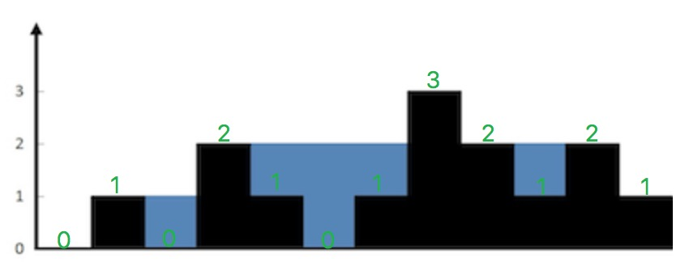
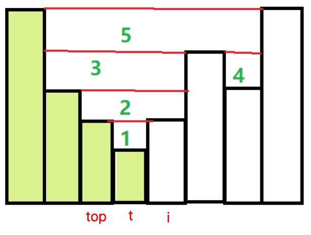

# 42. Trapping Rain Water

Given n non-negative integers representing an elevation map where the width of each bar is 1, compute how much water it is able to trap after raining.



The above elevation map is represented by array [0,1,0,2,1,0,1,3,2,1,2,1]. In this case, 6 units of rain water (blue section) are being trapped. Thanks Marcos for contributing this image!

Example:

```
Input: [0,1,0,2,1,0,1,3,2,1,2,1]
Output: 6
```

# Idea
对于每个index `i`，计算该index上方能储存的水量`M(i)`。该值取决于`i`左边最大值和右边最大值种更小的那个减去`i`的高度。即：

```
M(i) = min{ leftMax[i], rightMax[i] } - height[i]
```

比如`i=5`，`i`头上之所以有2个单位的雨水，是因为`i`左边最大值是2，右边最大值是3，所以取2，然后再减去自身高度0，结果就是2-0 = 2.

但注意：`i=0`头上不可能积存雨水，所以`i`从`1`开始遍历。

详细解释参考Youtube视频：
[https://youtu.be/HmBbcDiJapY](https://youtu.be/HmBbcDiJapY)

# Solution1: Brute force

```java
    // 方法一：Brute force: O(n^2), Time Limit Exceeded
    // 对于每个`i`，找到左边最大值和右边最大值，这两个值较小的那个决定了`i`头上的雨水的高度，减去height[i]即可
    static int trap(int[] height) {
        int n = height.length;
        int count = 0;

        for (int i=1; i<n; i++) {
            int leftMax = 0, rightMax = 0;
            for (int j=i; j>=0; j--) {
                leftMax = Math.max(leftMax, height[j]);
            }
            for (int j=i; j<n; j++) {
                rightMax = Math.max(rightMax, height[j]);
            }
            int rainAtCurrentIndex = Math.min(leftMax, rightMax) - height[i];
            count += rainAtCurrentIndex;
        }
        return count;
    }
```

# Solution2: Dynamic Programming

与其每次都重新遍历整个数组取寻找`LeftMax(i)`和`RightMax(i)`，不如保存下来。

```java
    // 方法二：Dynamic Programming: Time: O(n), Space: O(n)
    static int trap2(int[] height) {
        int n = height.length;
        if (n == 0) return 0;

        // LM(i): max height upto index `i`
        int[] LM = new int[n];
        LM[0] = height[0];
        for (int i=1; i<n; i++) {
            LM[i] = Math.max(LM[i-1], height[i]);
        }

        // RM(i): max height from index `i`
        int[] RM = new int[n];
        RM[n-1] = height[n-1];
        for (int i=n-2; i>=0; i--) {
            RM[i] = Math.max(RM[i+1], height[i]);
        }

        int count = 0;
        for (int i=1; i<n; i++) {
            count += Math.min(LM[i], RM[i]) - height[i];
        }
        return count;
    }
```

# Solution3: Stack

The key here is to calculate by level, in the order from 1 to 5.



遍历高度，如果此时栈为空，或者当前高度小于等于栈顶高度，则把当前高度的坐标压入栈，注意我们不直接把高度压入栈，而是把坐标压入栈，这样方便我们在后来算水平距离。

当我们遇到比栈顶高度大的时候，就说明有可能会有坑存在，可以装雨水。此时我们栈里至少有一个高度，如果只有一个的话，那么不能形成坑，我们直接跳过；如果多于一个的话，那么此时把栈顶元素取出来当作坑（图中`t`），新的栈顶元素（图中`top`）就是左边界，当前高度（图中`i`）是右边界，只要取二者较小的，减去坑的高度，长度就是右边界坐标减去左边界坐标再减1，二者相乘就是盛水量。

```java
    // 方法三：Stack: Time: O(n), Space: O(n)
    // Calculate by levels
    static int trap3(int[] height) {
        int n = height.length;
        Stack<Integer> s = new Stack<>();
        int count = 0;

        int i = 0;
        while (i < n) {
            if (s.isEmpty() || height[i] <= height[s.peek()]) {
                s.push(i++);
            } else {
                int t = s.pop();
                if (s.isEmpty()) continue;

                int distance = i - s.peek() - 1;
                int h = Math.min(height[i], height[s.peek()]) - height[t];
                count += distance * h;
            }
        }
        return count;
    }
```

# Solution4: Two Pointers

```java
    // 方法四：Two pointers: Time: O(n), Space: O(1)
    // 在方法二的基础上进一步优化
    static int trap4(int[] height) {
        int n = height.length;

        int left = 0, right = n-1;
        int leftMax = 0, rightMax = 0;
        int count = 0;

        while (left < right) {
            if (height[left] < height[right]) {
                if (height[left] >= leftMax) {
                    leftMax = height[left];
                } else {
                    count += leftMax - height[left];
                }
                left++;
            } else {
                if (height[right] >= rightMax) {
                    rightMax = height[right];
                } else {
                    count += rightMax - height[right];
                }
                right--;
            }
        }
        return count;
    }
```