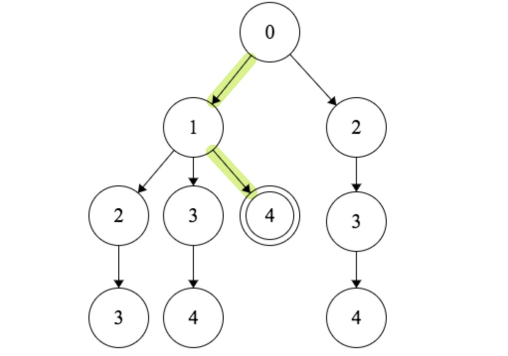
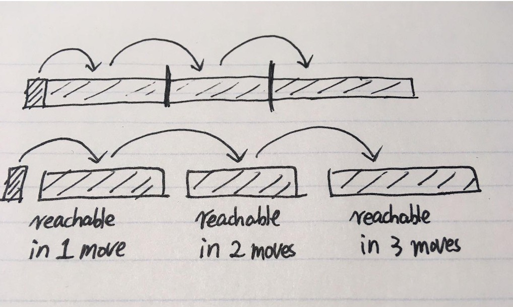

# 45. Jump Game II

Given an array of non-negative integers, you are initially positioned at the first index of the array.

Each element in the array represents your maximum jump length at that position.

Your goal is to reach the last index in the minimum number of jumps.

Example:

```
Input: [2,3,1,1,4]
Output: 2
Explanation: The minimum number of jumps to reach the last index is 2.
    Jump 1 step from index 0 to 1, then 3 steps to the last index.
```

# Idea

可以用Decision Tree来表示每一次jump的所有可能性，每个节点的数值是对应的下标。

比如对于输入`[2,3,1,1,4]`，Decision Tree如下：



This problem has a nice BFS structure. Let's illustrate it using the example `nums = [2, 3, 1, 1, 4]` in the problem statement. We are initially at position `0`. Then we can move at most `nums[0] = 2` steps from it. So, after one move, we may reach `nums[1] = 3` or `nums[2] = 1`. **So these nodes are reachable in `1` move.**

From these nodes, we can further move to `nums[3] = 1` and `nums[4] = 4`. Now you can see that the target `nums[4] = 4` is reachable in `2` moves.

总结：In every jump, we can reach any position within the next range.



# Solution

```java
	// Dynamic Programming: O(n^2), Time Limit Exceeded
    static int jump(int[] nums) {
        int n = nums.length;
        Integer[] dp = new Integer[n];
        dp[n-1] = 0;

        for (int i=n-2; i>=0; i--) {
            if (i + nums[i] >= n-1) {
                dp[i] = 1;
            } else {
                // 是否能从位置j跳到终点，如果能，最少多少步
                boolean canJump = false;
                int minSteps = Integer.MAX_VALUE;

                for (int j=i+1; j<= i+nums[i]; j++) {
                    if (dp[j] == null) continue;
                    canJump = true;
                    minSteps = Math.min(minSteps, dp[j]);
                }
                if (canJump) dp[i] = 1 + minSteps;   // 从i跳到j（1步）+ 从j跳到终点
            }
        }
        return dp[0];
    }

    // Greedy: O(n)
    // 每次都跳到最远处
    // 对于Decision Tree，currentEnd表示当前level的最大的数值
    static int jump2(int[] nums) {
        int jumps = 0;

        int farthest = 0;       // 下一步能跳到的最远位置
        int currentEnd = 0;

        for (int i=0; i<nums.length-1; i++) {
            farthest = Math.max(farthest, i+nums[i]);

            // 当前level check完毕，jump
            if (i == currentEnd) {
                jumps++;
                currentEnd = farthest;
            }
        }
        return jumps;
    }
```