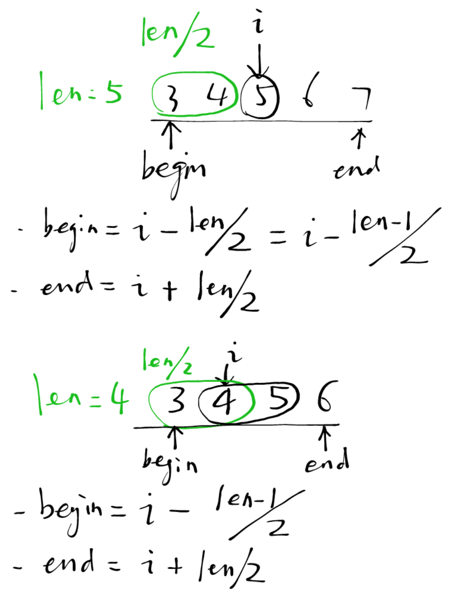

# 5. Longest Palindromic Substring

Given a string **s**, find the longest palindromic substring in **s**. You may assume that the maximum length of **s** is 1000.

**Example 1:**

```
Input: "babad"
Output: "bab"
Note: "aba" is also a valid answer.
```

**Example 2:**

```
Input: "cbbd"
Output: "bb"
```

## Solution

- 方法一：Bruteforce: Time: $O(n^3)$, Space: $O(1)$ 

```java
class Solution {
    public String longestPalindrome(String s) {
        int n = s.length();
        
        int maxLeft = 0, maxRight = -1;
        for (int i=0; i<n; i++) {
            for (int j=i; j<n; j++) {
                if (j-i>maxRight-maxLeft && isPalindrome(s, i, j)) {
                    maxLeft = i;
                    maxRight = j;
                }
            }
        }
        return s.substring(maxLeft, maxRight+1);
    }
    
    private boolean isPalindrome(String s, int i, int j) {
        while (i < j) {
            if (s.charAt(i) != s.charAt(j)) {
                return false;
            }
            i++; j--;
        }
        return true;
    }
}
```

- 方法二：Dynamic Programming: Time: $O(n^2)$, Space: $O(n^2)$ 

Top-Down

```java
class Solution {
    
    // M(i,j): Whether s[i..j] is palindrome
    // M(i,j) = (s[i]==s[j]) && M(i+1, j-1)
    // Base cases: M(i,j) = true, where i >= j
    public String longestPalindrome(String s) {
        int n = s.length();
        Boolean[][] memo = new Boolean[n][n];
        
        int maxLeft = 0, maxRight = -1;
        for (int i=0; i<n; i++) {
            for (int j=i; j<n; j++) {
                if (j-i>maxRight-maxLeft && isPalindrome(s, i, j, memo)) {
                    maxLeft = i;
                    maxRight = j;
                }
            }
        }
        return s.substring(maxLeft, maxRight+1);
    }
    
    private boolean isPalindrome(String s, int i, int j, Boolean[][] memo) {
        if (i >= j) return true;
        if (memo[i][j] != null) return memo[i][j];
        
        memo[i][j] = (s.charAt(i) == s.charAt(j)) && isPalindrome(s, i+1, j-1, memo);
        return memo[i][j];
    }
}
```

Bottom-Up

```java
class Solution {
    
    // M(i,j): Whether s[i..j] is palindrome
    // M(i,j) = (s[i]==s[j]) && M(i+1, j-1)
	// Base case: M(i, j) = true, if s[i]==s[j] AND (j=i || j=i+1) (That is, j-i <= 1)
    // 从递推公式可以看到，首先要知道了`i+1`行才能计算`i`行，所以外循环必须倒着遍历。（内循环无要求）
    public String longestPalindrome(String s) {
        int n = s.length();
        boolean[][] dp = new boolean[n][n];
        
        int maxLeft = 0, maxRight = -1;
        for (int i=n-1; i>=0; i--) {
            for (int j=n-1; j>=i; j--) {
                dp[i][j] = (s.charAt(i)==s.charAt(j)) && (j-i <= 1 || dp[i+1][j-1]);
                if (dp[i][j] && j-i > maxRight-maxLeft) {
                    maxLeft = i;
                    maxRight = j;
                }
            }
        }
        return s.substring(maxLeft, maxRight+1);
    }
}
```

- 方法三：Expand From Center: Time: $O(n^2)$, Space: $O(1)$

We can expand from different centers. A center can be one single character, such as `aba`, or two characters, such as `abba`.

```java
class Solution {
    public String longestPalindrome(String s) {
        int n = s.length();
        
        int maxLeft = 0, maxRight = -1;
        for (int i=0; i<n; i++) {
            int len1 = expandFromCenter(s, i, i);
            int len2 = expandFromCenter(s, i, i+1);
            
            int len = Math.max(len1, len2);
            if (len > maxRight-maxLeft+1) {
                maxLeft = i - (len-1)/2;
                maxRight = i + len/2;
            }
        }
        return s.substring(maxLeft, maxRight+1);
    }
    
    // (i, j) both sides not included
    private int expandFromCenter(String s, int i, int j) {
        while (i >= 0 && j < s.length() && s.charAt(i) == s.charAt(j)) {
            i--; j++;
        }
        return j-i-1;   // length of range (i, j)
    }
}
```

关于坐标：

