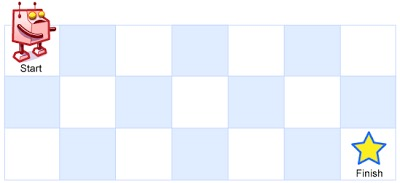
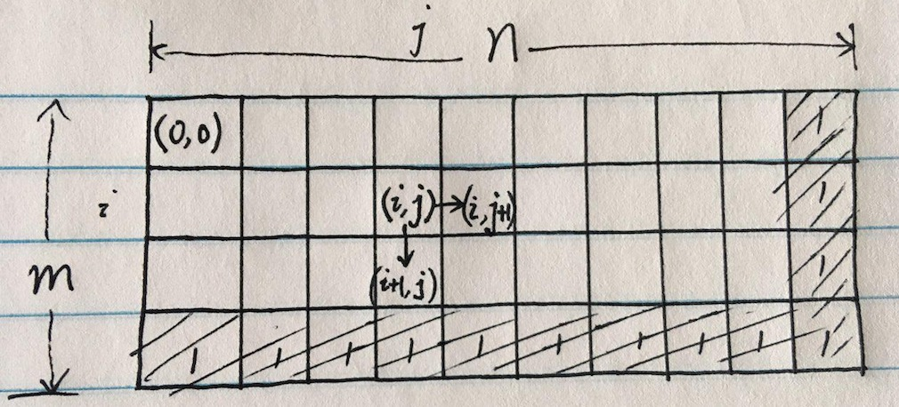

# 62. Unique Paths

A robot is located at the top-left corner of a m x n grid (marked 'Start' in the diagram below).

The robot can only move either down or right at any point in time. The robot is trying to reach the bottom-right corner of the grid (marked 'Finish' in the diagram below).

How many possible unique paths are there?



Above is a 7 x 3 grid. How many possible unique paths are there?

Note: m and n will be at most 100.

Example 1:

```
Input: m = 3, n = 2
Output: 3
Explanation:
From the top-left corner, there are a total of 3 ways to reach the bottom-right corner:
1. Right -> Right -> Down
2. Right -> Down -> Right
3. Down -> Right -> Right
```

Example 2:

```
Input: m = 7, n = 3
Output: 28
```

# Idea

这里m和n哪个代表行哪个代表列并不影响结果，可以互换。

M(i, j) = Number of unique paths from (i, j) to 'Finish'

可以先填充最后一行和最后一列，都为1，然后中间的M(i, j) = M(i+1, j) + M(i, j+1)

M(0, 0)即为所求。



# Solution

```java
    // M(i, j) = Number of unique paths from (i, j) to 'Finish'
    // M(i, j) = M(i+1, j) + M(i, j+1)
    // Solution: M(0,0)
    public int uniquePaths(int m, int n) {
        int[][] paths = new int[m][n];
        // bottom line
        for (int j=n-1; j>=0; j--) paths[m-1][j] = 1;
        // right column
        for (int i=m-1; i>=0; i--) paths[i][n-1] = 1;

        for (int i=m-2; i>=0; i--) {
            for (int j=n-2; j>=0; j--) {
                paths[i][j] = paths[i+1][j] + paths[i][j+1];
            }
        }
        return paths[0][0];
    }
```