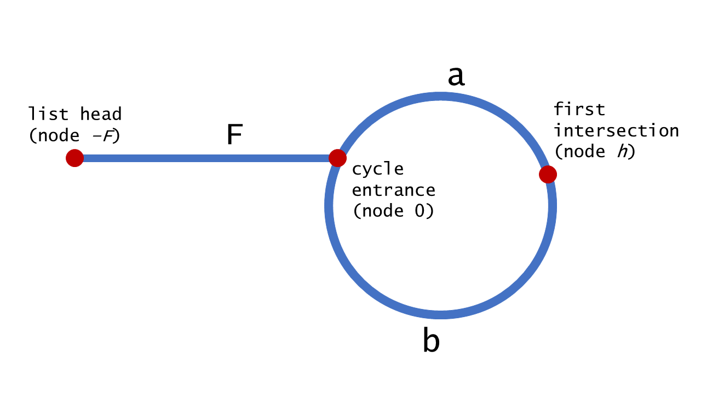

# [142. Linked List Cycle II](https://leetcode-cn.com/problems/linked-list-cycle-ii/)


Given a linked list, return the node where the cycle begins. If there is no cycle, return `null`.

To represent a cycle in the given linked list, we use an integer `pos` which represents the position (0-indexed) in the linked list where tail connects to. If `pos` is `-1`, then there is no cycle in the linked list.

**Note:** Do not modify the linked list.

**Example 1:**

```
Input: head = [3,2,0,-4], pos = 1
Output: tail connects to node index 1
Explanation: There is a cycle in the linked list, where tail connects to the second node.
```


**Example 2:**

```
Input: head = [1,2], pos = 0
Output: tail connects to node index 0
Explanation: There is a cycle in the linked list, where tail connects to the first node.
```


**Example 3:**

```
Input: head = [1], pos = -1
Output: no cycle
Explanation: There is no cycle in the linked list.
```


**Follow-up**:  
Can you solve it without using extra space?


## Solution

- 方法一：Set（$Space: O(n)$）

```java
public class Solution {
    public ListNode detectCycle(ListNode head) {
        Set<ListNode> set = new HashSet<>();
        
        for (ListNode p=head; p!=null; p=p.next) {
            if (!set.add(p)) return p;
        }
        
        return null;
    }
}
```

- 方法二：快慢指针（$Space: O(1)$）

```java
public class Solution {
    public ListNode detectCycle(ListNode head) {
        ListNode slow = head;
        ListNode fast = head;
        
        while (true) {
            if (fast==null || fast.next==null) return null;
            slow = slow.next;
            fast = fast.next.next;
            if (slow == fast) break;
        }
        
        fast = head;
        while (slow != fast) {
            slow = slow.next;
            fast = fast.next;
        }
        return fast;
    }
}
```

解析：



2(F+a) = (F+a+b+a)

==> F = b

因此第一次相遇后，将fast支针移到head并且一次只走一步，那么两支针会在环的入口点相遇。

> 环很小的情况，其实跟环很大是一样的，比如你可以理解为将多个小环的循环铺开，虚拟扩展成一个大环来理解。

摘录自 [网络](https://leetcode-cn.com/problems/linked-list-cycle-ii/solution/huan-xing-lian-biao-ii-by-leetcode/)