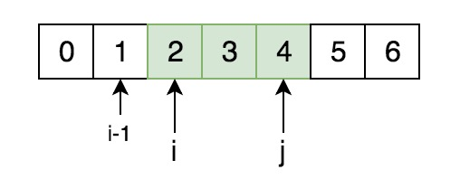
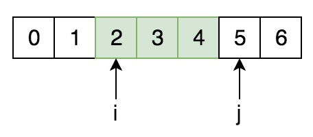
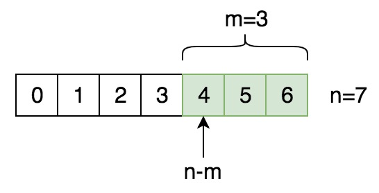
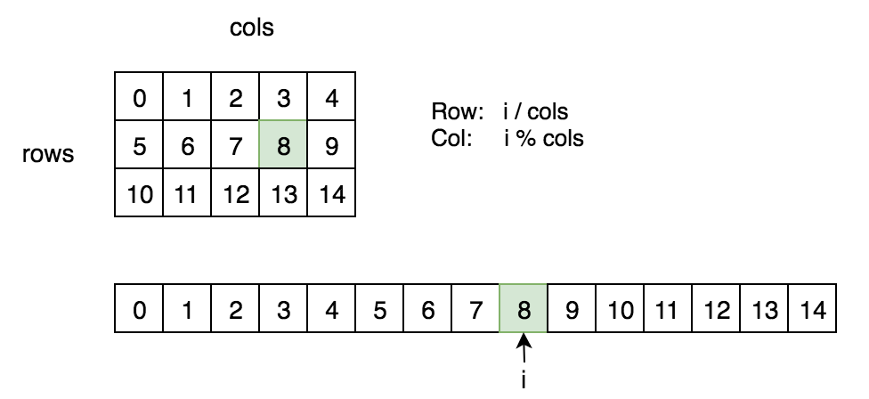
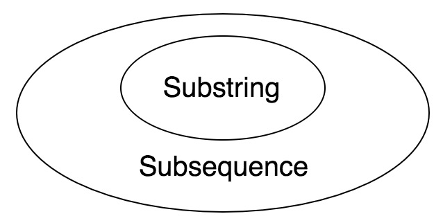

# Basics

- nums[] ---- length
- String/StringBuilder ---- length()
- List/ArrayList/LinkedList ---- size()

从index `i` 到index `j`（`[i, j]`），长度为`j-i+1`（或者说`j-(i-1)`，或者说`(j+1)-i`)



但对于index范围`[i, j)`，长度为`j-i`



总之，

- `[i, j]` 长度为`j-i+1`               （双闭合）
- `[i, j)` 和`(i, j]` 长度为`j-i`  （单开）
- `(i, j)` 长度为 `j-i-1`               （双开）


长度为`n`的字符串，从末尾向前取长度为`m`的子串的起始索引为`n-m`（因为向前移动1位是n-1，即最后一个元素，向前移动m位就是n-m）



## 二维数组下标转换



假如把二维数组看为一位数组，第 `i` 个数（从0开始）对应于二维数组中的第 `i / cols` 行，第 `i % cols` 列。这样就可以在 2-D sorted array 上进行 binarySearch。

> 每次遇到 wrap around 的情况时，都可以尝试用取余运算 (%).

## f(n) = 2f(n-1)

- f(1) = 1
- f(n) = 2f(n-1)

则有：

​	f(1) = 1 = $2^0$

​	f(2) = 2f(1) = $2^1$

​	f(3) = 2f(3) = $2^2$

​	...

​	f(n) = 2f(n-1) = $2^{n-1}$ 

## 生成 [a, b) 之间的随机数

```java
int r = (int) ((b-a) * Math.random() + a);
```

> Math.random() 其实是 random.nextDouble()，返回一个 [0, 1) 之间的随机数。

或者

```java
Random random = new Random();
int r = random.nextInt(b-a) + a;
```

> random.nextInt(n) 返回 [0, n) 之间的随机数。

## Substring vs Subsequence

- Substring必须连续，比如：`bcd` is a substring of `abcdef`
- 而Subsequence无需连续，比如：`ace` is a subsequence of `abcdef`



## Palindrome (回文)

a word or phrase that reads the same backwards as forwards, such as 'madam', 'cbbc'.

(正着读反着读都一样的词语)

## % 与 /

对于一个整数`x`，对其取模（ `x % 10`） 返回其个位数字；执行整除操作（`x / 10`）相当于去掉`x`的个位数。

例如：

```
263 % 10 = 3
263 / 10 = 26
```

可以反复使用这两个操作来遍历`x`的每个数字（个位，十位，百位……）

```java
while (x != 0) {
	int digit = x % 10;
	// ...
	
	x = x / 10;
}
```

> 一个自然数模n的取值范围是 0 ～ n-1，相当于对所有自然数”分组“。比如上面例子中，模10相当于把所有自然数依照其个位数字进行分组。

## 数组/List排序

```java
// 数组排序
int[] array = {6, 1, 2};
Arrays.sort(array);

// List排序
List<Integer> list = new ArrayList<>();
list.sort(Comparator.naturalOrder());
```

## 遍历链表

```java
// for a given ListNode head
ListNode p = head;
while (p != null) {
  // ...
  p = p.next;
}
```

或者

```java
for (ListNode p=head; p!=null; p=p.next) {
  // ...
}
```


## Dummy node

```java
public ListNode addTwoNumbers(ListNode l1, ListNode l2) {
  ListNode dummy = new ListNode(0);
  
  ListNode p = dummy;
  while (...) {
    // ...
    p.next = new ListNode(val);
    p = p.next;
  }
  
  return dummy.next;
}
```

之所以创建一个dummy node，是为了避免分情况讨论。否则代码将会非常的clumsy：

```java
public ListNode addTwoNumbers(ListNode l1, ListNode l2) {
  if (l1 == null && l2 == null) return null;
  
  // 这里需要把while循环内的代码重复写在这里
  // ...
  ListNode head = new ListNode(?);	// 因为?的值取决于l1和l2的第一个node的值
  
  ListNode p = head;
  while (...) {
    // ...
    p.next = new ListNode(val);
    p = p.next;
  }
  return head;
}
```

> 总结起来就是：当函数需要返回一个链表时，也就是说需要我们创建一个LinkedList时，通常可以创建一个dummy node来简化代码。但如果只有输入是链表而不需要返回链表，则无需创建dummy node。

## 求指数 2^n

```java
1 << n
```

`1 << 0`  =  1	2^0

`1 << 1`  =  2	2^1

`1 << 2`  =  4	2^2

`1 << 3`  =  8	2^3

...

## XOR `^` (Exclusive OR)

```
A ^ A = 0
A ^ 0 = A
```

> 不使用新的变量，交换两个变量的值：
>
> - 基于加减法
>
> ```java
> a = a + b;
> b = a - b;	// a + b - b = a
> a = a - b;
> ```
>
> - 基于XOR运算
>
> ```java
> a = a ^ b;
> b = a ^ b;	// a ^ b ^ b = a
> a = a ^ b;
> ```

## AND `&`

与`1`AND值不变， 与`0`AND总是`0` 

`x & (x-1)` clears the rightmost non-zero bit of x.（将x的最低的一个非零的bit位清零）

```go
func main() {
	num := 0b10110110
	fmt.Println(countOnes(num))		// 5
}

// 计算一个数的二进制表示中有多少个1
func countOnes(num int) int {
	count := 0
	for num != 0 {
		count++
		num &= num-1
	}
	return count
}
```


## OR `|` (Inclusive OR)
与`0`OR值不变，与`1`OR总是`1`

## Invert `~`

反转所有bit位：0变为1，1变为0

> ⚠️注意位运算符的优先级：`if ((num & mask) == 0)` ✅
>
> 注意一定要加括号，不能写成 `if (num & mask == 0)` ❌

## Bit Manipulation
```java
// To create 11111000, can left shift -1, which is 11111111
int mask = -1 << 3;

// To create 00000111, can left shift 1 to create 00001000, then minus one
mask = (1 << 3) - 1;

// Create 00111000 from last mask, just left shift mask
mask = mask << 3;
```

```java
    // AND
    static boolean getBit(int num, int i) {
        int mask = 1 << i;      // such as 00001000
        return (num & mask) != 0;
    }

    // OR
    static int setBitToOne(int num, int i) {
        int mask = 1 << i;      // such as 00001000
        return num | mask;
    }

    // AND
    static int setBitToZero(int num, int i) {
        int mask = ~(1 << i);
        return num & mask;
    }
```

## Bitwise运算符总结

注意运算符 `>>` 与 `>>>` 的区别。对于正数而言二者没什么区别。

`>>` 是 right shift，或者称作 算术右移位 (arithmetic right shift)，右移后在最左边补上符号位（正数是0，负数是1）

`>>>` 是 unsigned right shift，或者称作 逻辑右移位 (logical right shift)，右移后在最左边补0

> ⚠️注意：Java中并没有 `<<<` 运算符。

```
~       Unary bitwise complement
<<      Signed left shift (相当于 乘以2^n)
>>      Signed right shift (相当于 除以2^n)
>>>     Unsigned right shift (左侧补0)
&       Bitwise AND
^       Bitwise exclusive OR
|       Bitwise inclusive OR
```

> `a << n` 相当于 $a * 2^n$ 
>
> `a >> n` 相当于 $a/ 2^n$
>
> 就好像10进制数 321，如果左移1位，变成3210，相当于乘以$10^1$，左移2位相当于乘以$10^2$ ...
>
> 右移1位，变成32，相当于除以$10^1$，右移2位相当于除以$10^2$ ...
>
> 而 `<<` 和 `>>` 操作是2进制数，因此底数（base）是2

## Median 中位数

```java
    public static void main(String[] args) {
        // median for empty array is undefined
        int[] nums = {};
        System.out.println(median(nums));
    }

    // n是偶数：Median = (a[n/2-1] + a[n/2]) / 2.0
    // n是奇数：Median = a[n/2]
    private static double median(int[] nums) {
        int n = nums.length;

        if (n % 2 == 0) {
            return (nums[n/2-1] + nums[n/2]) / 2.0;
        } else {
            return nums[n/2];
        }
    }
```

另一种写法：

```go
func median(nums []int) float64 {
	n := len(nums)
	if n == 0 {
		return 0
	}

	mid := (n-1)/2	// mid index, prefer left when n is even
	if n % 2 == 0 {
		return float64(nums[mid] + nums[mid+1]) / 2.0
	} else {
		return float64(nums[mid])
	}
}
```


## Reverse

```java
    public static void main(String[] args) {
        int[] nums = {1,2,3,4,5,6};
        reverse(nums);
        System.out.println(Arrays.toString(nums));  // [6, 5, 4, 3, 2, 1]
    }


    // Reverse an array
    static void reverse(int[] nums) {
        int i=0, j=nums.length-1;

        while (i < j) {
            // swap a[i] and a[j]
            int tmp = nums[i];
            nums[i] = nums[j];
            nums[j] = tmp;
            i++; j--;
        }
    }
```

## Swap

```java
    static void swap(int[] nums, int i, int j) {
        int tmp = nums[i];
        nums[i] = nums[j];
        nums[j] = tmp;
    }
```

## 复制ArrayList

```java
List<Integer> list = new ArrayList<>();
// ...
List<Integer> copy = new ArrayList<>(list);
```

## LinkedList 逆序输出

```java
import java.util.ArrayList;
public class Solution {
    
    public ArrayList<Integer> printListFromTailToHead(ListNode listNode) {
        ArrayList<Integer> result = new ArrayList<>();
        helper(listNode, result);
        return result;
    }
    
    private void helper(ListNode listNode, ArrayList<Integer> result) {
        if (listNode == null) return;
        helper(listNode.next, result);
        result.add(listNode.val);
    }
}
```

## Arrays.asList(T... a)

```java
List<Integer> list = Arrays.asList(1,2,6,7);
```

注意：Arrays.asList(..) 方法返回的是其内部定义的ArrayList而不是`java.util.ArrayList`. 主要是为了避免复制整个数组，而且返回的ArrayList是`fixed-size`的，不可以添加元素，也不可以删除元素，但可以修改元素。

## 简化 (a < c && b < c) || (a > c && b > c)

要么a和b都小于c，要么他们都大于c

可以简化为`(a < c) == (b < c)`，也就是`(a < c)`和`(b < c)`要么都为true要么都为false。

## BFS (Breadth First Search)

```java
public class Solution {
    public ArrayList<Integer> BFS(TreeNode root) {
        ArrayList<Integer> result = new ArrayList<>();
        if (root==null) return result;
        
        Queue<TreeNode> q = new LinkedList<>();
        q.offer(root);
        
        while (!q.isEmpty()) {
            TreeNode node = q.poll();
            result.add(node.val);
            if (node.left != null) q.offer(node.left);
            if (node.right != null) q.offer(node.right);
        }
        return result;
    }
}
```

## GCD (Greatest Common Divisor)

> 辗转相除法，原理参考 [链接](https://blog.csdn.net/qq_37160773/article/details/88074513) 

```java
private int gcd(int x, int y) {
    while (y != 0) {
        int r = x % y;
        x = y;
        y = r;
    }
    return x;
}
```

使用Golang更加简洁：

```go
func gcd(x, y int) int {
	for y != 0 {
		x, y = y, x%y
	}
	return x
}
```

## Fibonacci (Fib)

```java
private static int fib(int n) {
    int x=0, y=1;
    for (int i=0; i<n; i++) {
        int next = x + y;
        x = y;
        y = next;
    }
    return x;
}
```

Golang：

```go
func fib(n int) int {
	x, y := 0, 1
	for i := 0; i < n; i++ {
		x, y = y, x+y
	}
	return x
}
```

