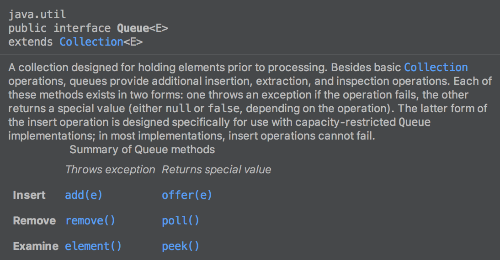

> ℹ️ `java.lang` 包是不需要import的。

## Stack (java.util)

```java
class Stack<E> extends Vector<E>
```

- `E push(E item)` 		入栈
- `synchronized E pop()`     出栈
- `synchronized E peek()`   返回栈顶元素（但不删除）
- `boolean isEmpty()` 
- `synchronized int size()` （Inherited from `Vector<E>` )

## Queue (java.util) (*Interface*)



- `boolean offer(E e);`  添加元素，成功返回true，失败返回false
- `E poll();` 删除队头元素，如果队列为空则返回null
- `E peek();` 返回队头元素（但不删除）
- `int size()` (Inherited from `Collection<E>` )
- `boolean isEmpty()`  (Inherited from `Collection<E>` )

**常用子类：**

- LinkedList	e.g. `Queue<Integer> queue = new LinkedList<>();` 
- Deque (*Interface*)
- ArrayDeque
- PriorityQueue

> ⚠️注意：ArrayList并不是Queue的实现类！

## Deque (java.util) (*Interface*)

```java
public interface Deque<E> extends Queue<E>
```


> Deque既可以当作Queue又可以当作Stack使用，也有push(E e) 和 pop()方法。

## PriorityQueue (java.util)

- *Min Heap*

```java
ArrayList<Integer> list = new ArrayList<>();
// ...
PriorityQueue<Integer> minHeap = new PriorityQueue<>(list);
```

- *Max Heap*

```java
ArrayList<Integer> list = new ArrayList<>();
// ...
PriorityQueue<Integer> maxHeap = new PriorityQueue<>(list.size(), Collections.reverseOrder());
maxHeap.addAll(list);
```

常用方法：

- `boolean offer(E e)` 添加元素 ($O(logn)$)
- `E poll()` 删除队头元素
- `E peek()` 查看队头元素，但不删除 ($O(1)$)
- `int size()` 
- `boolean isEmpty()` 

打印出所有元素：

```java
while (!minHeap.isEmpty()) {
    System.out.println(minHeap.poll());
}
```

## String (java.lang)

- Constructor

> ```java
> /** The value is used for character storage. */
> private final char value[];
> 
> public String(char[] value) {
>     this.value = Arrays.copyOf(value, value.length);
> }
> ```

- length()

> ```java
> public int length() {
>     return value.length;
> }
> ```

- isEmpty()

> ```java
> public boolean isEmpty() {
>     return value.length == 0;
> }
> ```

- charAt(int index)

> ```java
> public char charAt(int index) {
>     if ((index < 0) || (index >= value.length)) {
>         throw new StringIndexOutOfBoundsException(index);
>     }
>     return value[index];
> }
> ```

- char[] toCharArray()  

> ```java
> /**
>  * Converts this string to a new character array.
>  *
>  * @return  a newly allocated character array whose length is the length
>  *          of this string and whose contents are initialized to contain
>  *          the character sequence represented by this string.
>  */
> public char[] toCharArray() {
>     // Cannot use Arrays.copyOf because of class initialization order issues
>     char result[] = new char[value.length];
>     System.arraycopy(value, 0, result, 0, value.length);
>     return result;
> }
> ```

- void getChars(char dst[], int dstBegin)
- void getChars(int srcBegin, int srcEnd, char dst[], int dstBegin)

> ```java
> /**
>  * Copy characters from this string into dst starting at dstBegin.
>  */
> void getChars(char dst[], int dstBegin) {
>     System.arraycopy(value, 0, dst, dstBegin, value.length);
> }
> ```

- `byte[] getBytes()` Encodes this String into a sequence of bytes using the platform's default charset

- `byte[] getBytes(String charsetName) throws UnsupportedEncodingException` 

- `byte[] getBytes(Charset charset)` 

  示例：byte[] bytes = str.getBytes(StandardCharsets.UTF_8)

  或者：byte[] bytes = str.getBytes(Charset.forName("UTF-8"))

- `boolean startsWith(String prefix)` 
- `boolean endsWith(String suffix)` 
- `int indexOf(int ch)` Returns first occurrence of *ch*
- `int indexOf(int ch, int fromIndex)` Returns first occurrence of *ch*, starting the search at *fromIndex*
- `int lastIndexOf(int ch)` Returns last occurrence of *ch*
- `int lastIndexOf(int ch, int fromIndex)` Returns last occrrence of *ch*, starting the search at *fromIndex*
- `int indexOf(String str)` Returns first occurrence of *str*
- `int indexOf(String str, int fromIndex)` Returns first occurrence of *str*, starting the search at *fromIndex*
- `int lastIndexOf(String str)` Returns last occurrence of *str*
- `lastIndexOf(String str, int fromIndex)` Returns last occurrence of *str*, starting the search at *fromIndex*
- `String substring(int beginIndex)` 返回子串（从 *beginIndex* 一直到字符串结尾）
- `String substring(int beginIndex, int endIndex)` 返回子串 [*beginIndex*, *endIndex*) 长度为 end-begin
- `String replace(char oldChar, char newChar)` Replace all occurrences of *oldChar* with *newChar*
- `String replace(CharSequence regex, String replacement)` 替换字符串(All occurrences)
- `String replaceAll(String regex, String replacement)` 同上
- `String replaceFirst(String regex, String replacement)` 替换字符串(First occurrence)
- boolean matches(String regex)  等同于 Pattern.matches(regex, str)

> ```java
> public boolean matches(String regex) {
>     return Pattern.matches(regex, this);
> }
> ```

- boolean contains(CharSequence s)

> ```java
> public boolean contains(CharSequence s) {
>     return indexOf(s.toString()) > -1;
> }
> ```

- `String[] split(String regex)` 拆分

- `String toLowerCase()` 变小写

- `String toUpperCase()` 变大写

- `String trim()` 去掉首位所有空格

- `static String format(String format, Object... args)`

  示例：String.format("number: %d, name: %s", 3, "Jack")   ==>  "number: 3, name: Jack"

- `static String valueOf(int i)` 

  等同于 Integer.toString(i)，或者 i.toString(). 其他基本类型同理。

## StringBuffer/StringBuilder (java.lang)

Package: *java.lang* 

> Note: `StringBuffer`是线程安全的，而`StringBuilder`不是，在单线程中`StringBuilder`性能更优。
>
> 就如同`Hashtable`与`HashMap`的关系一样，前者是线程安全的，后者不是。

```java
StringBuilder sb = new StringBuilder();

sb.append(char/String);				// 在末尾追加字符/字符串
sb.deleteCharAt(int index);		// 删除指定位置的字符
sb.delete(int start, int end);	// 删除[start, end)区间的所有字符
sb.setLength(int len)						// 设置长度，只保留前'len'个字符
sb.insert(int offset, char/String);	// 在指定位置插入字符/字符串

sb.reverse();		// 反转
sb.setCharAt(int index, char c);	// 设置指定位置的字符

sb.length();						// 获取长度（直接返回'count'属性，所以是Constant time）

```

## Iterator<T> (java.util)

- `boolean hasNext();`
- `E next();` 
- `void remove();`

```java
List<Integer> list = new ArrayList<>();
Iterator<Integer> it = list.iterator();

while (it.hasNext()) {
    int num = it.next();
    // ...
    it.remove();
}
```

## Math (java.lang)

**Constants**

- `static final double E = 2.7182818284590452354`
- `static final double PI = 3.14159265358979323846`

**三角函数**

- `double sin(double a);`  其中a是弧度（angle in radians），例如 Math.PI / 2
- `double cos(double a);`
- `double tan(double a);`
- `double asin(double a);`
- `double acos(double a);`
- `double atan(double a);`

**算数运算**

- `int abs(int a);`  绝对值
- `int max(int a, int b);` 最大值
- `int min(int a, int b);` 最小值
- `double exp(double a);`  自然指数，返回 $e^a$ 
- `double pow(double a, double b);` 乘方（通用的指数运算），返回 $a^b​$ 
- `double log(double a);` 自然对数，返回 $log_e a​$ 
- `double log10(double a);` 以10为底的对数，返回 $log_{10} a$ 
- `double sqrt(double a);` 平方根（squre root），返回 $\sqrt{a}$ 
- `double  cbrt(double a);` 三次根（cube root），返回 $\sqrt[3]{a}$
- `double floor(double a);` 返回 $\lfloor {a} \rfloor$ 
- `double ceil(double a);` 返回 $\lceil {a} \rceil​$ 
- `int round(float a);` Round a float value to an integer. `round(3.4)=3`, `round(3.5)=4` 
- `long round(double a);` Round a double value to a long.


- `int addExact(int x, int y);`  `long addExact(long x, long y);` 

> ```java
> /**
>  * Returns the sum of its arguments,
>  * throwing an exception if the result overflows an {@code int}.
>  *
>  * @param x the first value
>  * @param y the second value
>  * @return the result
>  * @throws ArithmeticException if the result overflows an int
>  * @since 1.8
>  */
> public static int addExact(int x, int y) {
>     int r = x + y;
>     // HD 2-12 Overflow iff both arguments have the opposite sign of the result
>     if (((x ^ r) & (y ^ r)) < 0) {
>         throw new ArithmeticException("integer overflow");
>     }
>     return r;
> }
> ```

- `int subtractExact(int x, int y);`  `long substractExact(long x, long y);` 

- `int multiplyExact(int x, int y);`  `long multiplyExact(long x, long y);` 


- `int incrementExact(int a);`  `long incrementExact(long a);` 

> ```java
> /**
>  * Returns the argument incremented by one, throwing an exception if the
>  * result overflows an {@code int}.
>  *
>  * @param a the value to increment
>  * @return the result
>  * @throws ArithmeticException if the result overflows an int
>  * @since 1.8
>  */
> public static int incrementExact(int a) {
>     if (a == Integer.MAX_VALUE) {
>         throw new ArithmeticException("integer overflow");
>     }
> 
>     return a + 1;
> }
> ```


- `int decrementExact(int a);`   `long decrementExact(long a);` 

> ```java
> public static int decrementExact(int a) {
>     if (a == Integer.MIN_VALUE) {
>         throw new ArithmeticException("integer overflow");
>     }
> 
>     return a - 1;
> }
> ```


- `int negateExact(int a);`  `long negateExact(long a);` 

> ```java
> public static long negateExact(long a) {
>     if (a == Long.MIN_VALUE) {
>         throw new ArithmeticException("long overflow");
>     }
> 
>     return -a;
> }
> ```


**生成随机数**

- `double Math.random();` 

> ```java
> // 使用静态内部类实现singleton模式（Random对象单例）
> private static final class RandomNumberGeneratorHolder {
>    	static final Random randomNumberGenerator = new Random();
> }
> 
> public static double random() {
>    	return RandomNumberGeneratorHolder.randomNumberGenerator.nextDouble();
> }
> ```

> 生成 [a, b) 之间的随机整数：`int r = (int) ((b-a) * Math.random() + a);` 
>
> 或者 `int r = random.nextInt(b-a) + a;` 【 random.nextInt(n) 返回 [0, n) 之间的随机数）】

**Random 类** （Copied from [an online blog](https://www.cnblogs.com/skywang12345/p/3341423.html)）

```java
// 构造函数(一)： 创建一个新的随机数生成器。 
Random() 
// 构造函数(二)： 使用单个 long 种子创建一个新随机数生成器： public Random(long seed) { setSeed(seed); } next 方法使用它来保存随机数生成器的状态。
Random(long seed) 

boolean nextBoolean()         // 返回下一个“boolean类型”伪随机数。 
void    nextBytes(byte[] buf) // 生成随机字节并将其置于字节数组buf中。 
double  nextDouble()          // 返回一个“[0.0, 1.0) 之间的double类型”的随机数。 
float   nextFloat()           // 返回一个“[0.0, 1.0) 之间的float类型”的随机数。 
int     nextInt()             // 返回下一个“int类型”随机数。 
int     nextInt(int n)        // 返回一个“[0, n) 之间的int类型”的随机数。 
long    nextLong()            // 返回下一个“long类型”随机数。 
```

> 注：对于给定的seed，生成的伪随机数序列是确定的。

