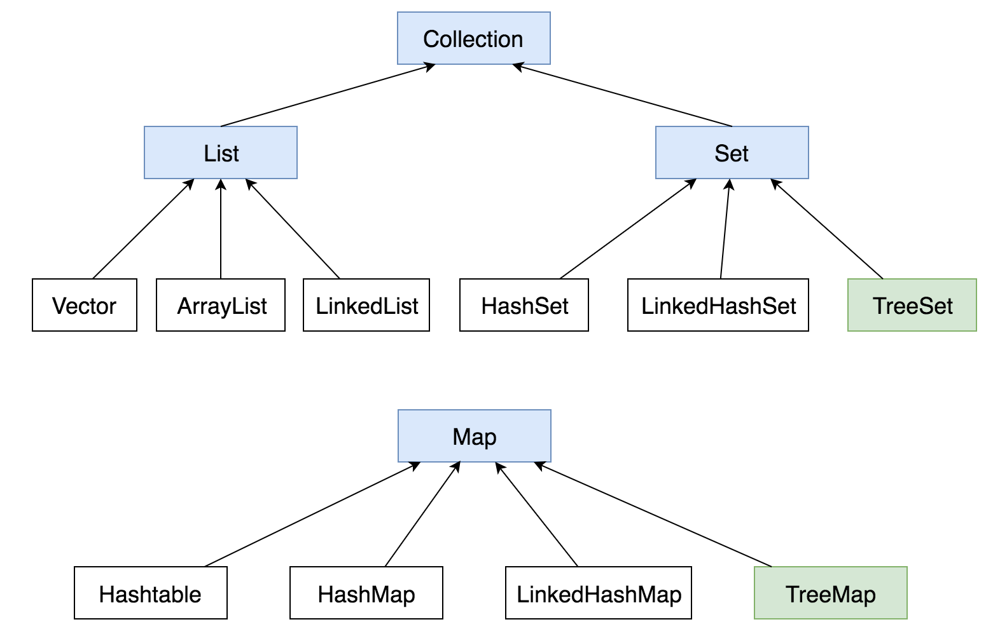

# Java Collections Framework



- `Vector` 和 `Hashtable` 是线程安全的(synchronized).

- `TreeSet` 和 `TreeMap`  的keys是按照数值大小(*natural order*)排序的，例如：

```java
TreeSet<Integer> set = new TreeSet<>();
set.add(3);
set.add(1);
set.add(5);
set.add(2);

System.out.println(Arrays.asList(set.toArray()));   // [1, 2, 3, 5]
```

>  ⚠️Set中的元素是不可重复的，添加重复的元素时add方法返回false（但不会抛出异常）

- `LinkedHashSet` 和 `LinkedHashMap` 的keys是按照插入顺序(*insertion-order*)排列的.

## Comparable ['kɑmpərəbl]

```java
public interface Comparable<T> {
    
	public int compareTo(T o);
    
}
```

Integer, Long, Float, Double, String 等都实现了这个接口。

`x.compareTo(y)` 如果x<y则返回`-1`，如果x==y则返回`0`，如果x>y则返回`1`.

```java
// Integer.compare(x, y)
public static int compare(int x, int y) {
    return (x<y)? -1 : ((x==y)? 0 : 1);
}
```

## Comparator

```java
public interface Comparator<T> {
	int compare(T o1, T o2);	// 如果o1<o2返回一个负数，如果o1==o2返回0，如果o1>o2返回一个正数
}
```

使用方法：

```java
new Comparator<Integer>() {

    @Override
    public int compare(Integer x, Integer y) {
        //return (x<y)? -1 : ((x==y)? 0 : 1);
        //return Integer.compare(x, y);
        return x.compareTo(y);
    }
};
```

对于基本类型的排序，可以直接使用 `Comparator.naturalOrder()` 和 `Comparator.reverseOrder()` 

## Collection

> The root interface in the *collection hierarchy*. A collection represents a group of objects, known as its elements. Some collections allow duplicate elements and others do not. Some are ordered and others unordered.

- 是否允许重复元素 (allow duplicates?)
- 是否有序 (ordered?)