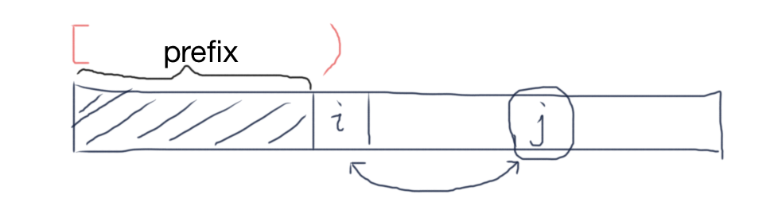

# GenerateStrings and Permutations
`generateStrings(alphabet, k)`是使用`alphabet`作为字母表生成所有长度为`k`的字符串，字符可以重复使用。

而`permute(nums)`生成`nums`的所有排列，元素不可以重复使用，因此有

```
permute(nums) = generateStrings(nums, nums.length) 并且不可重复使用元素
```

## 问题1：generateStrings(alphabet, k)
- Input: an alphabet containing **distinct** elements, and an integer `k`
- Output: All strings of length `k` generated with the `alphabet`

Example:

```
Input: alphabet="123", k=2
Output: [11, 12, 13, 21, 22, 23, 31, 32, 33]
```

Example2:

```
Input: alphabet="123", k=3
Output: [111, 112, 113, 121, 122, 123, 131, 132, 133, 211, 212, 213, 221, 222, 223, 231, 232, 233, 311, 312, 313, 321, 322, 323, 331, 332, 333]
```

## Solution

```java
    static ArrayList<String> generateStrings(String alphabet, int k) {
        ArrayList<String> result = new ArrayList<>();
        generateStrings(alphabet, k, new StringBuilder(), result);
        return result;
    }

    static void generateStrings(String alphabet, int k, StringBuilder prefix, ArrayList<String> result) {
        if (prefix.length() == k) {
            result.add(prefix.toString());
            return;
        }

        for (int j = 0; j < alphabet.length(); j++) {
            // Generate all strings that start with a[j]
            prefix.append(alphabet.charAt(j));
            generateStrings(alphabet, k, prefix, result);
            prefix.setLength(prefix.length() - 1); // clean up - restore the value of `prefix`
        }
    }
```

## 问题2：permute(nums)

- Input: an integer array with **distinct** elements
- Output: All permutations of these elements

Example:

```
Input: nums = [1,2,3]
Output: [[1, 2, 3], [1, 3, 2], [2, 1, 3], [2, 3, 1], [3, 1, 2], [3, 2, 1]]
```

## Solution

```java
    // 方法一：类似于GenerateStrings(nums.length)，只是加了一行代码防止重复选取某个元素
    // M(i): Get all permutations that start with a[i]
    static List<List<Integer>> permute(int[] nums) {
        List<List<Integer>> result = new ArrayList<>();
        permute(nums, new ArrayList<>(), result);
        return result;
    }

    private static void permute(int[] nums, List<Integer> prefix, List<List<Integer>> result) {
        if (prefix.size() == nums.length) {
            result.add(new ArrayList<>(prefix));
            return;
        }

        for (int i=0; i<nums.length; i++) {
            if (prefix.contains(nums[i])) continue;     // 防止重复选取a[i]
            // 生成所有以`a[i]`开头的排列
            prefix.add(nums[i]);
            permute(nums, prefix, result);
            prefix.remove(prefix.size()-1);     // clean up - restore the value of `prefix`
        }
    }


    // 方法二：A[0..i) is fixed, i.e. prefix = A[0..i)
    // M(i): permute A[i..END]
    static List<List<Integer>> permute2(int[] nums) {
        List<List<Integer>> result = new ArrayList<>();
        permute2(nums, 0, new ArrayList<>(), result);
        return result;
    }

    private static void permute2(int[] nums, int i, List<Integer> prefix, List<List<Integer>> result) {
        if (prefix.size() == nums.length) {
            result.add(new ArrayList<>(prefix));
            return;
        }

        for (int j=i; j<nums.length; j++) {
            // swap values at `j` and `i`
            swap(nums, j, i);

            // 固定A[i]，并排列剩下的元素A[i+1..END]
            prefix.add(nums[i]);
            permute2(nums, i+1, prefix, result);

            // swap it back
            swap(nums, j, i);
            prefix.remove(prefix.size()-1);
        }
    }

    private static void swap(int[] nums, int i, int j) {
        int tmp = nums[i];
        nums[i] = nums[j];
        nums[j] = tmp;
    }
```

方法一 Golang版本：

```go
func permute(nums []int) [][]int {
    var result [][]int
    var prefix []int
    used := make([]bool, len(nums))
    helper(nums, prefix, &result, used)
    return result
}

func helper(nums []int, prefix []int, result *[][]int, used []bool) {
    n := len(nums)
    if len(prefix) == n {
        // add prefix to result
        tmp := make([]int, n)
        copy(tmp, prefix)
        *result = append(*result, tmp)
        return
    }

    for i := range nums {
        if used[i] { // avoid dups
            continue
        }
        // generate all permutations that start with nums[i]
        prefix = append(prefix, nums[i])
        used[i] = true
        helper(nums, prefix, result, used)
        // cleanup - restore the states
        prefix = prefix[:len(prefix)-1]
        used[i] = false
    }
}
```

另外，方法二可以进一步简写：

> Instead of using an additional array to store prefix, we can use a point `i` and `A[0..i)` stands for prefix. The prefix can then be extended by swapping values in `A[i:]` with `A[i]`.

```go
func permute(nums []int) [][]int {
	var result [][]int
	helper(nums, 0, &result)
	return result
}

// A[0..i) is fixed, i.e. prefix = A[0..i)
// then permute A[i:]
func helper(nums []int, i int, result *[][]int) {
	n := len(nums)
	if i == n {
		// add prefix to result (as i == n, prefix is the whole array)
		tmp := make([]int, n)
		copy(tmp, nums)
		*result = append(*result, tmp)
		return
	}

	for j := i; j < n; j++ {
		// swap values at i and j
		nums[i], nums[j] = nums[j], nums[i]
		// extend prefix, then permute A[i+1:]
		helper(nums, i+1, result)
		// clean up: restore states
		nums[i], nums[j] = nums[j], nums[i]
	}
}
```

注意`starting with a[i]`和`starting from index i`之间的区别：

```
"strings starting with a[i]=2": {23, 24, 25, 26...}
"numbers starting from index i": {nums[i], nums[i+1], ... nums[n-1]}
```

分析：第一种方法因为每次需要判断`prefix.contains(nums[i])`，即每次都需要遍历`prefix`以确定是否已经包含了`nums[i]`，所以效率低于方法二。但也可以使用一个额外的数组`included[]`来标记已经用过的元素来提高效率。

## 问题3：permute(nums) with duplicates

- Input: an integer array which may contains duplicates
- Output: All permutations of these elements

Example:

```
Input: nums = [2, 2, 3]
Output: [[2, 2, 3], [2, 3, 2], [3, 2, 2]]
```

这一题就不能像上面方法一那样简单地通过`prefix.contains(nums[i])`判断了，但可以继续使用方法二，但要保证开头元素不重复，可以使用Set.



```java
	// A[0..i) is fixed, prefix = A[0..i)
	// M(i): permute A[i..END]
    private static List<List<Integer>> permute(int[] nums) {
        List<List<Integer>> result = new ArrayList<>();
        helper(nums, 0, new ArrayList<>(), result);
        return result;
    }

    private static void helper(int[] nums, int i, List<Integer> prefix, List<List<Integer>> result) {
        int n = nums.length;
        if (prefix.size() == n) {
            result.add(new ArrayList<>(prefix));
            return;
        }

        Set<Integer> set = new HashSet<>();
        for (int j=i; j<n; j++) {
            if (set.contains(nums[j])) continue;

            swap(nums, j, i);

            // 固定A[i]，并排列剩下的元素A[i+1..END]
            set.add(nums[i]);
            prefix.add(nums[i]);
            helper(nums, i+1, prefix, result);

            swap(nums, i, j);
            prefix.remove(prefix.size()-1);
        }
    }

    private static void swap(int[] nums, int i, int j) {
        int tmp = nums[i];
        nums[i] = nums[j];
        nums[j] = tmp;
    }
```

可以进一步简写，省去prefix数组：

```go
func permuteUnique(nums []int) [][]int {
	var result [][]int
	helper(nums, 0, &result)
	return result
}

// A[0..i) is fixed, i.e. prefix = A[0..i)
// then permute A[i:]
func helper(nums []int, i int, result *[][]int) {
	n := len(nums)
	if i == n {
		// add prefix to result (as i == n, prefix is the whole array)
		tmp := make([]int, n)
		copy(tmp, nums)
		*result = append(*result, tmp)
		return
	}

	// consider position i, we should not put same number twice at this position
	// use a set to store values in A[i..n)
	set := make(map[int]bool)
	for j := i; j < n; j++ {
		if set[nums[j]] {
			continue
		}

		// swap values at i and j, extend prefix
		nums[i], nums[j] = nums[j], nums[i]
		set[nums[i]] = true
		// then permute A[i+1:]
		helper(nums, i+1, result)
		// clean up: restore states
		nums[i], nums[j] = nums[j], nums[i]
	}
}
```


