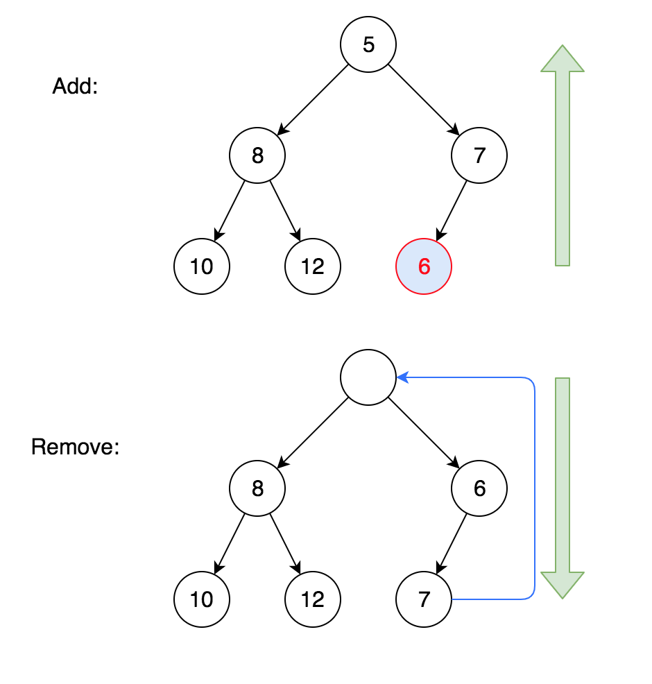

# Heap

Min-Heap Property: Every node is no less than its parent. Then the root node is the smallest.

> The value of parent is less than or equal to its children.

## Major Operations

| Operation    | Description                                                  |
| :----------- | :----------------------------------------------------------- |
| add/offer    | Add to the last, then siftUp⬆︎                                |
| remove/poll  | Remove the first element, move the last to first, then siftDown⬇︎ |
| build a heap | For every non-leaf node (from last to first), siftDown⬇︎      |

> The last non-leaf node is the parent of last element. The last element is at index `n-1`, and its parent `(n-1-1)/2` = `(n/2)-1`.

## Visualization



Also, visit [An online visualization site by Dr. David Galles](https://www.cs.usfca.edu/~galles/visualization/Heap.html).

## Implementation

```java
package basics;

import java.util.Arrays;
import java.util.Collection;

public class Heap {

    public static void main(String[] args) {
        Heap heap = new Heap(Arrays.asList(8, 35, 21, 6, 2, 1, 3));
        System.out.println(heap);   // print its backed array

        while (!heap.isEmpty()) {
            System.out.println(heap.remove());
        }
    }

    // For index i, index of its parent: (i-1)/2
    // index of its left and right children are 2*i+1 and 2*i+2
    private int[] nums = new int[100];
    private int size = 0;

    // Build an empty heap
    public Heap() {
    }

    // Build a heap: Copy to nums, then for every non-leaf node (from last to first), siftDown
    public Heap(Collection<Integer> list) {
        for (int num : list) {
            nums[size++] = num;
        }

        for (int i=(size/2)-1; i>=0; i--) {
            siftDown(i);
        }
    }

    // Add to the last, then siftUp
    public void add(int num) {
        nums[size++] = num;
        siftUp(size-1);
    }

    // Remove the first element, move the last to first, then siftDown
    public int remove() {
        int first = nums[0];
        nums[0] = nums[size-1];
        size--;
        siftDown(0);
        return first;
    }

    public int peek() {
        return nums[0];
    }


    private void siftUp(int index) {
        // As long as it has parent
        while (index > 0) {
            int parent = (index-1)/2;
            if (nums[index] >= nums[parent]) break;

            // otherwise, swap them and then move up
            swap(nums, index, parent);
            index = parent;
        }
    }

    private void siftDown(int index) {
        // As long as it has left child
        while (2*index+1 < size) {
            // We want to get the smaller one of its children
            int left = 2*index+1;
            int right = 2*index+2;  // may not exist

            int smallerChild = left;
            if (right < size && nums[right] < nums[left]) {
                smallerChild = right;
            }

            if (nums[index] <= nums[smallerChild]) break;
            swap(nums, index, smallerChild);
            index = smallerChild;
        }
    }

    public int size() {
        return size;
    }

    public boolean isEmpty() {
        return size == 0;
    }

    @Override
    public String toString() {
        StringBuilder sb = new StringBuilder();
        for (int i=0; i<size; i++) {
            if (i > 0) sb.append(' ');
            sb.append(nums[i]);
        }
        return sb.toString();
    }

    private void swap(int[] nums, int i, int j) {
        int tmp = nums[i];
        nums[i] = nums[j];
        nums[j] = tmp;
    }
}
```

