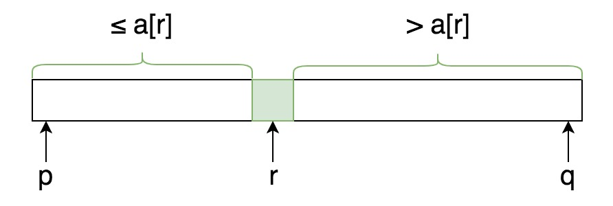
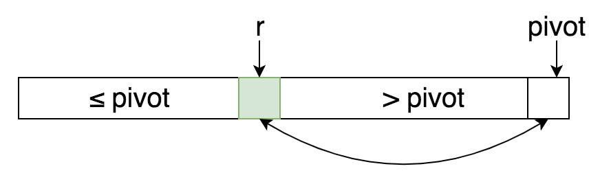

# QuickSort and getKthElement

## QuickSort
First partition `nums` into two parts, then sort them by recursive calls.



```java
    void quickSort(int[] nums) {
        quickSort(nums, 0, nums.length-1);
    }

    private void quickSort(int[] nums, int p, int q) {
        if (p >= q) return;
        
        int r = partition(nums, p, q);     // `r` is the position of the pivot
        quickSort(nums, p, r-1);
        quickSort(nums, r+1, q);
    }

    // a[p..r-1] always contains elements that are <= pivot
    // 开始时r=p，如果a[i]<=pivot则swap到r指向的位置并increment r（类似于SelectionSort）
    private int partition(int[] nums, int p, int q) {
        int r = p;
        int pivot = nums[q];    // 取最后一个元素为pivot

        for (int i=p; i<q; i++) {
            if (nums[i] <= pivot) {
                // swap a[i] to a[r]
                swap(nums, i, r++);
            }
        }
        // 把a[q], 即pivot, 交换到r的位置（即把pivot放在正确位置）
        swap(nums, q, r);
        return r;
    }

    private int swap(int[] nums, int i, int j) {
        int tmp = nums[i];
        nums[i] = nums[j];
        nums[j] = tmp;
    }
```

partition的执行过程：



## getKthElement

Input: an array `A` that is NOT sorted, and an integer `k`

Note: If the array A is already sorted then just return A[k]. So in most cases A is not sorted.

**Note: k = 0, 1, 2, ... n-1**

```java
    public static void main(String[] args) {
        int[] nums = {3,2,7,-1,8,5};
        System.out.println(getKthElement(nums, 0));     // -1

        quickSort(nums);
        System.out.println(Arrays.toString(nums));     // [-1, 2, 3, 5, 7, 8]
    }

    // 应用quicksort里的partition方法
    // 注意：k = 0,1,2,...n-1
    public static int getKthElement(int[] nums, int k) {
        return getKthElement(nums, k, 0, nums.length-1);
    }

    public static int getKthElement(int[] nums, int k, int p, int q) {
        int r = partition(nums, p, q);

        if (k == r) return nums[r];
        if (k < r) return getKthElement(nums, k, p, r-1);
        else return getKthElement(nums, k, r+1, q);
    }
```

也可以写成iterative.

```java
    private int getKthElement(int[] nums, int k) {
        int low=0, high=nums.length-1;
        while (true) {
            int r = partition(nums, low, high);
            if (r == k) return nums[r];
            if (r < k) low=r+1;
            else high=r-1;
        }
    }
```

