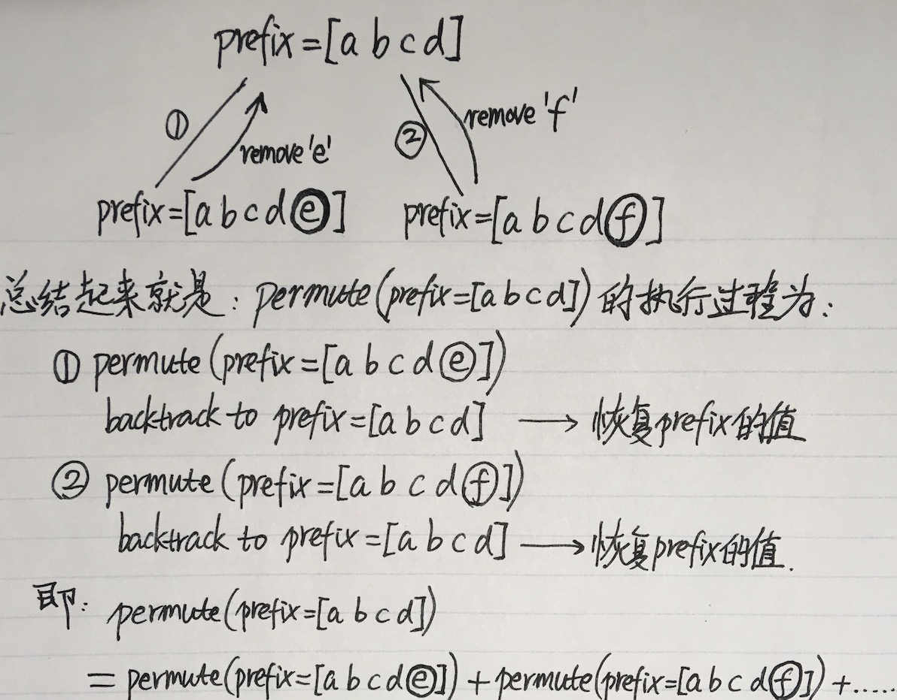

# Backtracking（回溯法）
回溯法的核心是在当前状态下前进一步尝试一种可能的情况，递归调用以求解前进后状态的结果，然后clean up (回溯到之前的状态)；然后接着再前进一步尝试另一种可能的情况，递归调用……

* `prefix`代表被确定了的位置，比如求 {<u>a, b, c, d</u>, e, f} 的排列时，如果`prefix=[a b c d]`，则接下来`prefix`可能的值为：`[a b c d] e`和`[a b c d] f`



因为`prefix`是个List，为了避免每次都创建一个新的`prefix`副本，我们采用修改`prefix`（向其中添加元素），然后在递归调用了之后再把`prefix`复原（把刚添加进去的那个元素删除）的方法。

如果`prefix`是个String，则可以直接拼接（这样因为创建了另外一个String对象，所以在递归调用后不会修改当前`prefix`的值，也就不需要做“恢复prefix”的步骤。）

# 帮助理解
比如递归调用：

```java
int f(int n) {
	if (n==0) return 0;	// base case

	return f(n-1);
}
```

同样可以这样写：

```java
int f(int n) {
	if (n==0) return 0;	// base case
	
	n = n-1;				// change `n`
	int result = f(n);		// recursive call with the new `n`
	n = n+1;				// clean up - restore `n` to its previous value
	return result;
}
```

我们在`f()`中调用`f(n-1)`时，因为n是基本数据类型，所以在调用`f(n-1)`时使用的是一个单独的变量（传值调用，会创建一个新的变量副本），而不会改变`f()`中的`n`. 但如果`n`是个对象，创建一个新的对象然后递归调用当然也可以做到不改变`f()`中`n`的值，但是会非常影响效率，因为每次调用都需要复制整个对象，因此直接在`f()`中修改`n`，传给`f(n-1)`然后在`f(n-1)`执行完后恢复`n`的值，以便再次进行递归调用来尝试其他可能的情况（当然，上面这个例子因为比较简单所以并不需要尝试其他情况）。